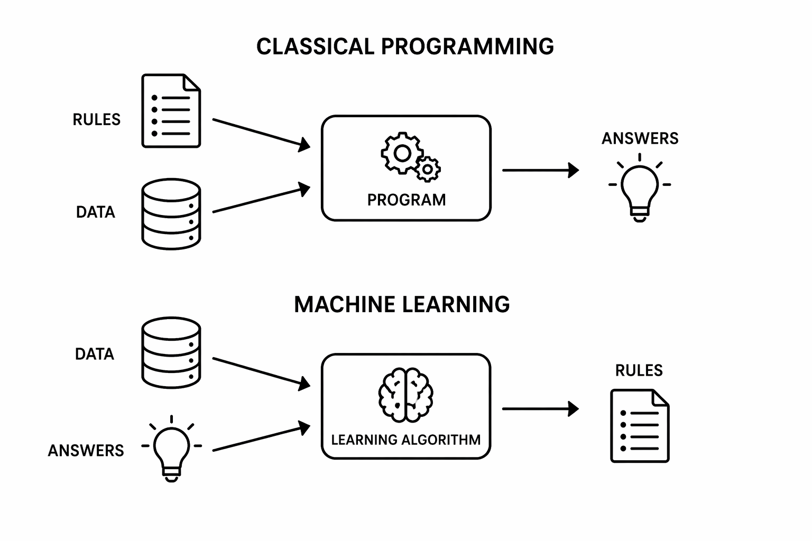

2026-04-20: 80 min

| Time (min) | Duration | Topic                           | Additional materials |
|------------|----------|---------------------------------|----------------------|
| 0–23       | 23       | Foundations                     |                      |
| 23–46      | 23       | The Generalization Problem      |                      |
| 46–68      | 22       | The Machine Learning Workflow   |                      |
| 68–90      | 22       | Performance                     |                      |

TODO:

- Suggest code reading/understanding exercises (e.g., "what are the next steps of the procedure?", "annotate what is done in the code blocks", "give pseudocode", "are there any errors (e.g., switched code blocks)?")

## Group work topics

Check which topics were selected by groups, identify potential overlap and guide topic selection.

## Supervised ML

Note: moved unsupervised ML (clustering) to EDA (mention here only as an example of unsupervised ML)

{width=600px fig-align=center}

- Start by sketching the two process boxes
- Illustrate what "classical programming" means: manually codifying all conditions and special cases to make the prediction
- Ask students what the input/output is
- Highlight for machine learning: at training time, to make predictions, we will use the rules in the sense of classical programming

Reminder: In the earlier lectures, we already saw appropriate evaluation measures (confusion matrix, F1, ... for classification, $R^2$ for regression)

Highlight: The *objective function* typically includes a *loss function* (e.g., RSS in OLS) that quantifies how well or poorly the model fits the observed data. (May also include regularization terms)

## Bias-Variance tradeoff

Variance: draw many training datasets from the population, train the model on each one, analyze fluctuation in predictions

## Generalization Problem

**Question** (go back to the supervised-ML slide showing “Dataset + Learning algorithm (model class + objective + optimizer) → predictive model”):
How can we improve *generalization* (performance on unseen data)?

- Use train/test splits (or cross-validation) to evaluate generalization performance
- Control model complexity through regularization by modifying the objective/loss function
   (e.g., penalizing too many features or overly complex nonlinear relationships)

Emphasize the objective-function connection mathematically:

$$\min_{\theta}; \text{Loss}(\theta) + \lambda \cdot \text{Complexity}(\theta)$$

That equation often helps students understand that regularization literally changes the optimization target.

## Training/Test data

Highlight: tabular data (features in rows). Only for deep learning, unstructured data can be used as an input (learns patterns automatically)

## Problems with fixed training and test samples

Optimizing the model training: refers to

- Hyperparameter tuning
- Feature engineering decisions
- Model design choices
- Training procedure tweaks

Problem: the test data does not remain "unseen"

“Endogenization of the test data” means that the test set—supposed to be an external, independent benchmark—becomes internally involved in the model-building process.

## Selection bias

> **Model-selection bias** occurs when a model appears better simply because many hyperparameter configurations were tried and the best-performing one was selected.

Grid search and cross-validation reduce the risk of selecting a hyperparameter setting that only performs well on a single accidental split of the data.

- **Grid search** explores different hyperparameter configurations systematically.
- **Cross-validation** evaluates each configuration robustly across multiple train/validation splits.

Key point:

- Grid search performs **model selection**.
- Cross-validation provides a more reliable estimate of **generalization performance** during that selection process.
- A final untouched test set helps address remaining model-selection bias.

## Exercises

2026-04-20: 75 min (`Data Analytics with Python.pdf` : partitioning (p.20) and cross-validation (p.41).)

Note: this exercise should be a focused work-through-a-full-cross-validation effort.
Announce that we will treat ML algorithms as black boxes for now (except for using their specific hyperparameters).
They all have to be implemented according to the same workflow.



## Materials

- Nice introduction: https://kuleshov-group.github.io/aml-website (careful: copyright!)
- Lecture: https://harvard-iacs.github.io/2019-CS109A/lectures/lecture7/presentation/Lecture7_ModeLSelectionRegularization.pdf
- https://github.com/kuleshov/cornell-cs5785-2025-applied-ml/blob/main/lecture-notes/lecture2-supervised-learning.ipynb

- https://jose.theoj.org/papers/10.21105/jose.00239
   -> slides not useful for ABD
   -> Exercises: penguin dataset, but maybe useful as an inspiration.
- https://github.com/Cambridge-ICCS/practical-ml-with-pytorch/tree/main/exercises

- instructive animations on neural networks etc.:  https://www.3blue1brown.com/topics/neural-networks
- Andrew Ng lecture:  https://www.youtube.com/watch?v=jGwO_UgTS7I
- https://cs229.stanford.edu/

<!--

https://learningds.org/ch/16/ms_intro.html

Feature engineering:
https://www.kaggle.com/learn/feature-engineering

Nice "whats wrong with the procedure":
https://courses.cs.washington.edu/courses/cse446/26sp/schedule/lectures/05-train%20test%20split%20cross%20validation.pdf

Exercises in jupyter:
https://github.com/intro-stat-learning/ISLP_labs/
https://harvard-iacs.github.io/2019-CS109A/labs/lab9/notebook/

https://inria.github.io/scikit-learn-mooc/python_scripts/02_numerical_pipeline_cross_validation.html
-->
