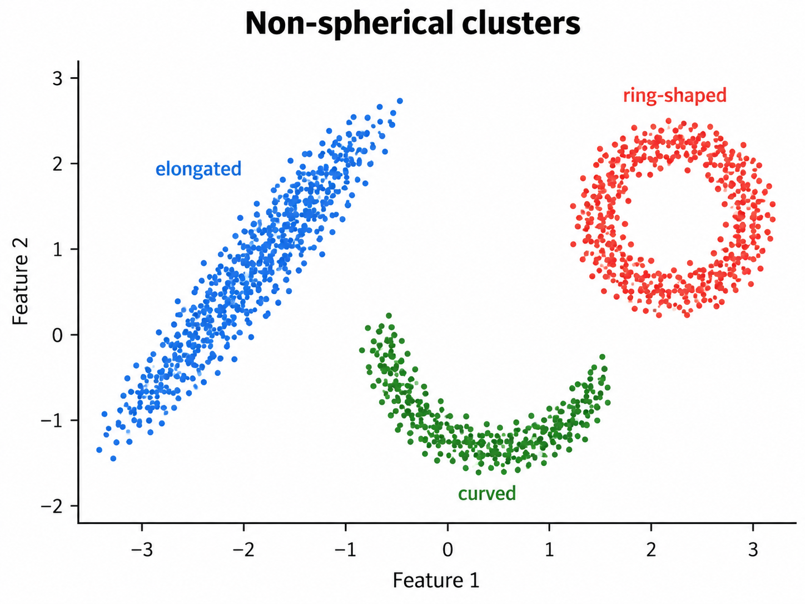

Preparation:

- Prep follow-up to survey responses
- Print `session_02_solution.html`

| Time (min) | Topic                                      | Additional materials |
|------------|--------------------------------------------|----------------------|
| 0–20       | Univariate exploratory data analysis       |                      |
| 20–40      | Multivariate exploratory data analysis     |                      |
| 40–90      | Clustering in EDA                          |                      |

: {tbl-colwidths="[20,40,40]"}

<!--
But: Sometimes it is better to know/predict something even if we cannot explain it instead of doing nothing! Examples:

- Recommendation systems: Which movie are you likely to watch next? Thousands of variables may be available; we may never know why exactly a particular recommendation works, but recommendations generally improve engagement/revenue. ("We don't know/don't give a recommendation" is the worst option)
 -> Business decision to recommend anything is always better than no recommendation at all
- Fraud detection: prediction of irregular and fraudulent transactions can be very accurate, but the attackers' goal is to behave in a way that is hard to anticipate. Prediction may focus on identifying cases that are "not behaving regularly" (rather than identifying generalizable patterns)
-->

### Previous exercise

- Take time to solve the previous exercise sheet, in particular the last exercise (long code).
- Make sure students understand the functional programming pipes and object assignment.
- Point to [Posit Cheatsheets](https://opensource.posit.co/resources/cheatsheets/?languages=R), in particular the [tidyr cheatsheet](https://opensource.posit.co/resources/cheatsheets/tidyr/) and [stringr cheatsheet](https://opensource.posit.co/resources/cheatsheets/strings/)
- Open `View(data_df)` and code in console. Then copy working code to the `.qmd` file.

For the last part (long data preparation):

- Inspect data frame (`View()` or Environment)
- Income: requires formatting and missing value handling. Go to docs of `parse_number()` and `mutate()`.
- Date: requires multiple format conversion -> code illustrates custom function call
- Filter: select only plausible (consistent values)
- Unifying categorical values: explain `~` pattern
- In `distinct()`, the `.keep_all = TRUE` parameter is important. Otherwise, it will return distinct values of the column.

TODO: check: date conversion did not handle all?!? - understand logic of the function

TODO/TBD: 

## In-class exercise

Ask students to open a new `.qmd` file and run the statistics from the slides (when there are many, select one).

### Histogram: ggplot2 introduction

Explain ggplot2 principles:

1. The `ggplot()` is the plot object and receives the data as the first parameter (neeeds to be in tidy data format)
2. The `aes()` is used to map variables. Note: when colors are used inside `aes(color=...)`, they change with the level of the variable.
3. There are different geometries to choose from (`geom_bar()`, `geom_point()`, etc.)
4. Advice: start small, use examples from the docs, then add complexity. Use Cheatsheets.

For the historgram, note that this is a unidimensional visualization where a numerical variable is segmented and charted.

On the following slides, illustrate how the code is adapted for different chart types.

Multivariate EDA: the `aes()` can be in the plot object or the geometry layer.

### EDA/Clustering

<!--
TODO: Illustrate how k-means clustering works for a given k (random centroids/assignments, recalculation of centroids), using different colors
-->

- `set.seed(42)` makes the random initialization reproducible.
- `nstart = 25` makes K-means try 25 different initializations and keep the best one (criterion: smallest total within-cluster sum of squares).
- Data type: `X` is not a data frame (`kmeans()` is Base R), but the expected structure is still tidy data. 

{fig-align="center" width="50%"}



## Exercise

| Time (min) | Duration | Topic | Additional materials |
|------------|----------|-------|----------------------|
| 0–25 | 25 | EDA: Clustering | `exercises/session_03.qmd` |
| 25–35 | 10 | Wrap-up | |

### EDA Clustering

- Focus on the existing R clustering workflow: select `profit_margin` and `rd_intensity`, inspect their distributions, standardize them, compare k-means solutions, add labels, and interpret grouped revenue box plots.

### Group work (depending on time / maybe shift to next session)

Briefly have the groups summarize their topics, discuss ideas and current challenges.
