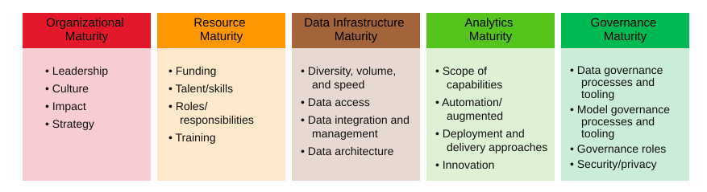
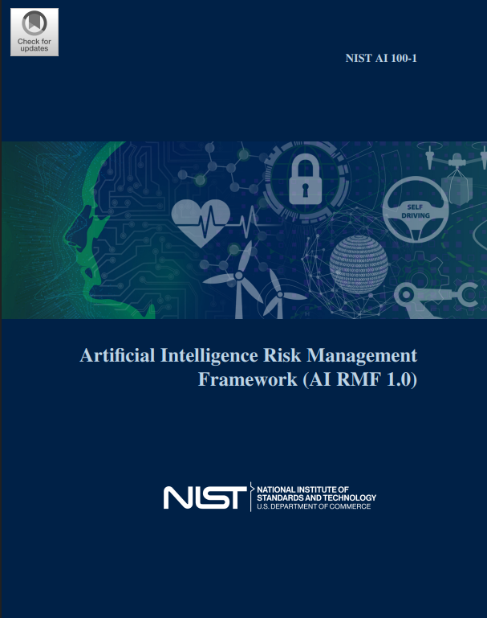
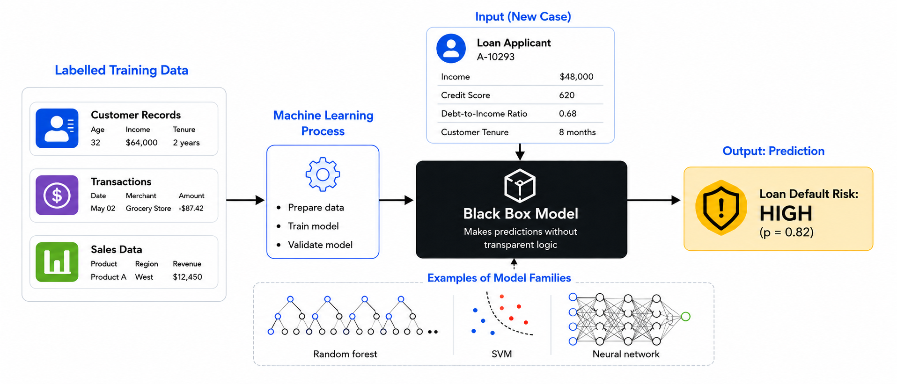
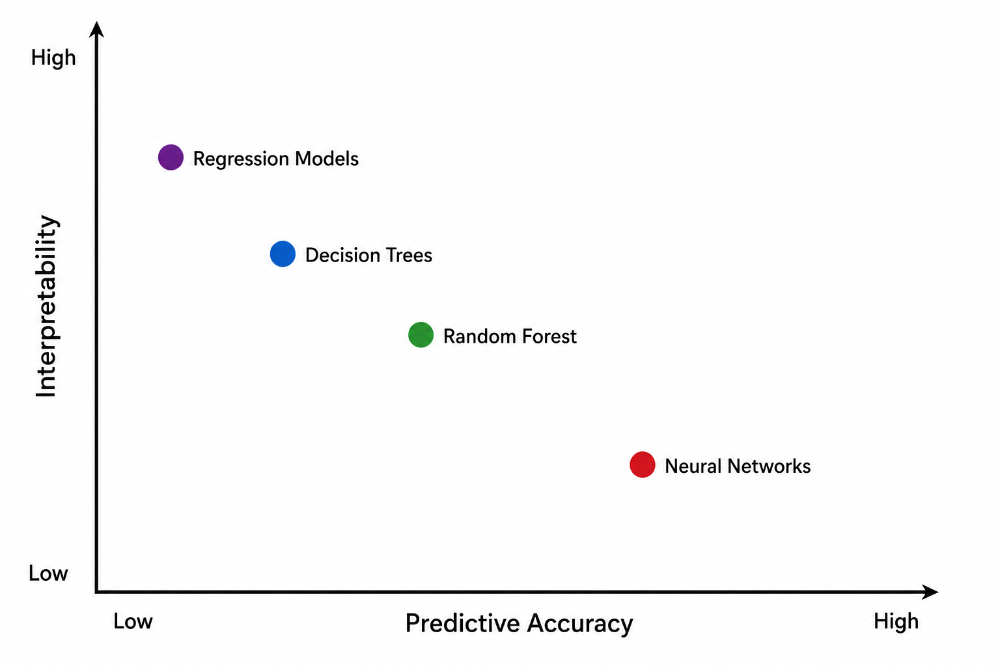
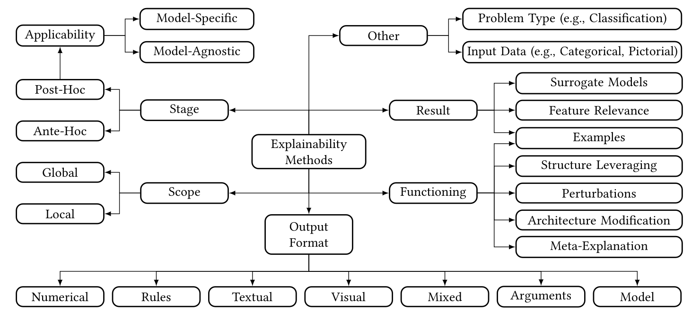
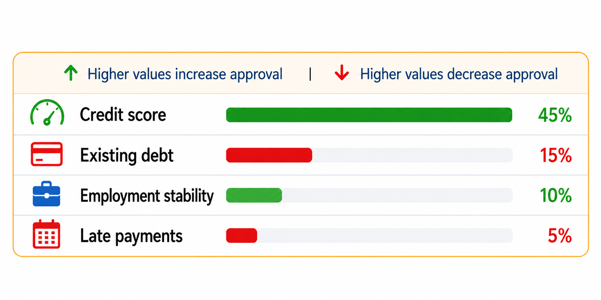
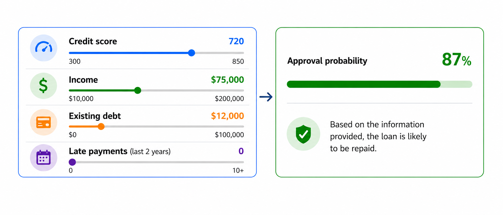
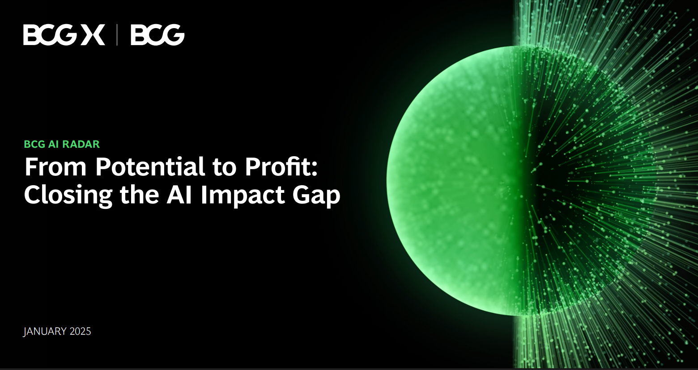
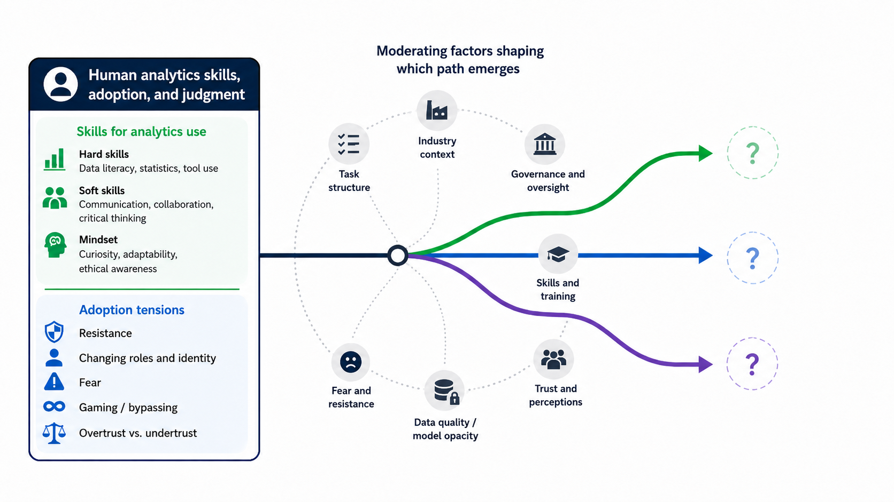

## {data-menu-title="Learning objectives" data-state="hide-menubar"}

     

::: {.learning-objectives}
- **Explain** the strategic role of data analytics in data-driven organizations.
- **Discuss** the ethical and legal boundaries of data analytics in organizations.
:::

<!--
- **Design** an end-to-end analytics solution aligned with a business problem and governance constraints.
-->

# Industry-level perspectives {data-stack-name="Industry"}

## Does the deployment of analytics pay off?

**@MullerFayBrocke2018: The Effect of Big Data and Analytics on Firm Performance**

The study examines whether firms with live **big data and analytics (BDA) assets** show higher productivity than comparable firms without such assets.

::: {.columns}
::: {.column width="50%"}
**Empirical setting**

- 814 publicly traded firms
- 2008–2014 panel data
- 5,698 firm-year observations
- Objective data on live BDA assets
- Financial data from Compustat
:::

::: {.column width="50%"}
**Outcome and controls**

- Outcome: $\log(Sales)$
- Inputs: labor, capital, materials
- Controls: General IT, industry, and year
- Moderators: IT intensity and competition
:::
:::

 

$$
\begin{aligned}
\log(Sales) =\;& \beta_0 + \beta_1 \log(Labor) + \beta_2 \log(Capital) + \beta_3 \log(Materials) \\
&+ \beta_4 BDA + Controls + \varepsilon
\end{aligned}
$$

::: notes
Cobb–Douglas-style production function  
log-linear model (not a logistic regression)  
Fixed effects: each firm has its own intercept (addressing omitted variable bias)

The study follows the IT business value tradition and uses a Cobb–Douglas production function.
BDA is operationalized as ownership of live BDA assets, not as a self-reported perception of analytics maturity.

It is challenging to isolate the effects of analytics from those of AI or IT more broadly.
:::

## Findings

:::: {.columns}

::: {.column width="50%"}

::: {style="font-size: 0.85em;"}

|                         | OLS | FE |
|-------------------------|:----------:|:---------:|
| log(Capital)            | 0.090*** (0.015) | 0.127*** (0.029) |
| log(Labor)              | 0.296*** (0.024) | 0.472*** (0.043) |
| log(Materials)          | 0.667*** (0.023) | 0.442*** (0.035) |
| BDA                     | 0.041** (0.020)  | 0.038* (0.021)   |
| Industry dummies?       | Yes      | Yes      |
| Year dummies?           | Yes      | Yes      |
| IT Asset dummies?       | Yes      | Yes      |
| Observations            | 5,698    | 5,698    |
| $R^2$                   | 0.977    | 0.791    |
| Adjusted $R^2$          | 0.977    | 0.755    |

:::

:::

::: {.column width="50%" .fragment}

**Key findings and implications**

- **Analytics assets alone are insufficient:** value depends on complementary resources such as data infrastructure, enterprise systems, and analytical skills.
- **Industry conditions matter:** IT-intensive and highly competitive industries show clearer productivity effects.
- **Causality remains difficult:** observational firm-level data can reduce, but not fully eliminate, concerns about reverse causality and omitted variables.

At the industry level, analytics deployment should be understood as part of a broader configuration of digital capabilities, competitive pressure, and organizational capacity to turn data into decisions.

:::

::::

::: notes

The high $R^2$ is expected because $\log(Sales)$ is modeled with major production inputs, especially $\log(Materials)$, $\log(Labor)$, and $\log(Capital)$, plus industry/year controls. It should not be interpreted as “BDA explains 97.7% of sales.”
:::

<!--
Note: highlight:

- methods (OLS + fixed effects/causality)
- differences between industries (context matters)
"Competing on analytics"
-->

## A meta-analysis

**@OesterreichAntonTeuteberg2022: What translates big data into business value?**

This meta-analysis examines how differences in **business analytics (BA) resources, capabilities, and contextual factors** are associated with differences in firm performance.

 

::: {.columns}
::: {.column width="40%"}
**Empirical setting**

- 125 firm-level studies
- 123 articles
- 2012–2021 research period
- 26 countries, four continents
- 358 effect sizes
- Quantitative synthesis through meta-analysis
:::

::: {.column width="60%"}

{width=90% fig-align=center .searchable-svg}

:::
:::

::: notes
This is a variance perspective because the study explains variation in firm performance through variation in organizational resources, capabilities, and contextual conditions.

The paper complements Müller et al. (2018): rather than focusing on objective BDA assets and productivity in one panel dataset, it synthesizes many firm-level studies and asks which BA-related factors matter most across the literature.
:::

## Meta-analysis results

 

::: {style="font-size: 0.75em;"}

| Independent variable | n | N | Estimated effect | 95% CI | Heterogeneity |
|------|--:|--:|----:|---:|-------:|
| BA technical resources | 91 | 39,246 | 0.452 | 0.409–0.493 | Q = 1920.153**, df = 90, I² = 95.31% |
| BA human resources | 42 | 9,219 | 0.494 | 0.444–0.541 | Q = 379.967**, df = 41, I² = 89.21% |
| BA management capabilities | 69 | 16,074 | 0.477 | 0.433–0.519 | Q = 861.169**, df = 68, I² = 92.10% |
| Data quality | 14 | 3,088 | 0.434 | 0.328–0.528 | Q = 142.257**, df = 13, I² = 90.86% |
| Organizational culture | 18 | 3,698 | 0.472 | 0.391–0.546 | Q = 153.939**, df = 17, I² = 88.96% |
| External pressure | 17 | 3,644 | 0.165 | 0.036–0.288 | Q = 248.937**, df = 16, I² = 93.57% |
:::

 

. . . 

**Key findings and implications**

- BA is positively associated with firm performance across studies.
- The strongest effects are linked to **human resources**, **management capabilities**, and **organizational culture**.
- Technical resources and data quality matter, but they do not explain value creation alone.
- External pressure shows a smaller effect.
- High heterogeneity indicates that BA value creation remains context-dependent.

::: {.notes}
IV = independent variable; n = number of studies; N = sample size; k = number of correlations;
Est. eff. = estimated summary effect size; CI = 95% confidence interval;
PI = 80% prediction interval; significance: ** p < .01, * p < .05, not significant (n.s.) for p > .05; $\tau^2$ = between-study variance;
I2 = proportion of variance attributed to between-study variance;
† indicates the number of missing studies necessary for each identified study to nullify the effect, calculated as fail-safe N divided by n; DF = degree of freedom.
:::

# Organizational perspectives {data-stack-name="Organizations"}

## A process perspective

**@KunzSpohrerHeinzl2025: Process-level value creation from business analytics**

This theoretical literature review examines **how business analytics creates value in organizational processes** and how **machine learning changes these value-creation paths**.

::: {.columns}
::: {.column width="50%"}
**Research focus**

- Process-level value creation
- Business analytics systems in use
- Organizational decision-making
- Knowledge creation and use
- Effects of ML-based analytics
:::

::: {.column width="50%"}
**Method and evidence base**

- Theoretical literature review
- Emergent theory building
- 176 articles synthesized
- Information Value Chain as sensitizing lens
- Six value-creation paths identified
:::
:::

 

. . . 



::: notes
- RQ 1: How does business analytics create value for organizations?
- RQ 2: How does machine learning change value creation from business analytics?

This slide shifts from variance-based explanations of performance differences to a process perspective:
analytics creates value through sequences linking data, information, knowledge, decisions, actions, and process-level outcomes.

Kunz, Spohrer, and Heinzl identify six process-level value creation paths.
They also argue that ML changes BA value creation through autonomy, dynamism, and opacity, which strengthens decision automation and feedback loops while complicating knowledge creation and transfer.
:::

## Value creation paths



::: notes

* **Ia. Canonical information processing path**
  The emergency department dashboard shows waiting times, patient acuity, bed availability, and historical bottlenecks.
  The shift lead interprets these data, updates their understanding of the situation, decides to reassign nurses, and acts accordingly.

* **Ib. Decision augmentation path**
  A prediction model flags that a patient is likely to deteriorate within two hours.
  The physician does not fully understand the model’s reasoning but uses the risk score as an additional input alongside clinical judgment.

* **Ic. Decision automation path**
  When predicted waiting-room congestion exceeds a threshold, the system automatically sends low-acuity patients to a partner urgent-care clinic and updates appointment slots without human approval.

* **IIa. Knowledge accumulation path**
  Over months, the hospital learns that congestion is not mainly caused by emergency arrivals but by delayed discharges from specific wards after 3 p.m.
  This accumulated insight leads to redesigning discharge routines.

* **IIb. Knowledge transfer path**
  Insights from the emergency department are shared with radiology, inpatient wards, and hospital management.
  Radiology adjusts staffing because ED bottlenecks often follow imaging delays; wards change discharge planning.

* **IIc. Feedback path**
  Clinicians notice that the deterioration-risk model overpredicts risk for elderly patients with certain chronic conditions.
  They report this, the data science team revises features and retrains the model, and future alerts become more relevant.

:::

<!--
Note: maybe add explanations on the following slide?!

TODO:
- cover canonical information processing path, decision augmentation vs. automation
- cover knowledge accumulation path, transfer, feedback

TODO: prepare connection from key-KPI/north-star to the use of analytics in different processes (learning system)
-->

## How machine learning changes value creation



<ul>
  <li class="fragment" data-fragment-index="1">
    <strong>Autonomy</strong> leads to a stronger reliance on analytical information for decision-making and action
  </li>
  <li class="fragment" data-fragment-index="2">
    <strong>Dynamism</strong> involves knowledge and data-driven feedback to improve the ground truth or the analytical system
  </li>
  <li class="fragment" data-fragment-index="3">
    <strong>Opacity</strong> refers to the inscrutability of machine learning models, which restricts human understanding and process improvement
  </li>
</ul>

## Towards a mature analytics portfolio

The **TDWI Analytics Maturity Model** offers a diagnostic framework for assessing analytics capabilities across organization, resources, data infrastructure, analytics, and governance.

The model classifies analytics maturity into five stages:

- **Nascent → Early → Established → Mature → Advanced/Visionary**

TDWI’s model supports a structured assessment of where an organization’s analytics portfolio currently stands and where further development may be needed.

{width=90% fig-align="center" .searchable-svg}

::: aside
Based on @Halper2020
:::

::: notes
TDWI emphasizes that analytics maturity is not only about techniques or software; it includes organizational processes, culture, resources, data management, and governance.
For our purposes, the model is useful because it makes the analytics portfolio assessable across several dimensions and maturity stages.
The strategic alignment question is central: are analytics initiatives connected to overall organizational goals, and are they supported by leadership, funding, roles, and governance?
:::

<!--
Managing analytics requires organizations to coordinate a portfolio of capabilities, including **reporting, dashboards, self-service analytics, ML/AI, and operational analytics**.

A central implication is that analytics maturity depends on the alignment between analytics initiatives, organizational strategy, decision-making processes, roles, funding, and governance.

**Manage analytics as a portfolio — not as isolated tools.**

    ## Deployment of analytics

    {width=50% fig-align=center .searchable-svg }

    Maturity (Analytics portfolio)

    https://go.tdwi.org/rs/626-EMC-557/images/TDWI_Analytics-Maturity-Model-Assessment-Guide_2020.pdf
-->

## Responsible deployment: Analytics and AI risk management

Advanced analytics increasingly becomes part of **AI systems** when it informs, recommends, or automates consequential decisions.

::: columns
::: {.column width="50%"}
**NIST AI Risk Management Framework**

- **Govern**: roles, policies, accountability
- **Map**: context, stakeholders, intended use
- **Measure**: performance, bias, robustness, risks
- **Manage**: mitigation, monitoring, incident response

**Deployment questions**

- Who is affected?
- What decision is supported or automated?
- What can go wrong?
- Who is accountable?
- How do we know when to stop or intervene?
:::

::: {.column width="50%"}
{width=55% fig-align=center}
:::
:::

. . . 

The *GDPR* (Art. 15 and 22) and the *AI Act* (Art. 27 and 86) require organizations to support responsible use of consequential automated decisions:
affected persons need meaningful information, human intervention and contestability, while deployers of high-risk AI systems need transparency, oversight, logging, and fundamental-rights assessments.

::: notes
This slide connects the maturity-model idea to responsible analytics. Analytics deployment is not only about technical maturity or portfolio maturity.
It also requires risk-management maturity. NIST is useful because it gives students a vocabulary that travels across analytics, machine learning, and AI governance.

- **GDPR Art. 15 and Art. 22: automated decision-making**  
  Data subjects can receive meaningful information about the logic involved in relevant automated decision-making, including significance and envisaged consequences.
  In specified cases, safeguards include human intervention, expressing one’s view, and contesting the decision.

- **AI Act Art. 13: transparency and instructions for use**  
  High-risk AI systems must provide information that helps deployers interpret outputs and use the system appropriately, including intended purpose, performance limits, risks, human oversight measures, and logging mechanisms.

- **AI Act Art. 27 and Art. 86: fundamental-rights assessment and explanation**  
  For certain high-risk AI uses, deployers must assess fundamental-rights impacts before deployment.
  Affected persons may also have a right to clear and meaningful explanations of the role of the AI system in relevant individual decisions.

Also: **GDPR: processing of personal data**: Personal data may only be processed with a lawful basis, such as contract necessity, legal obligation, legitimate interest, or valid consent.
In employment settings, consent is often problematic because of the power imbalance.
GDPR also requires purpose limitation, data minimization, transparency, retention limits, and accountability.
:::

## Boundaries: what should not be optimized?

Analytics creates value only within legitimate organizational, ethical, and legal boundaries.

 

::: columns
::: {.column width="50%"}
**Possible boundaries**

- Privacy and purpose limitation
- Non-discrimination and fairness
- Safety and reliability
- Human autonomy and dignity
- Legal compliance
- Organizational values
:::

::: {.column width="50%"}
**Examples**

| Use case | Boundary question |
|---|---|
| Employee analytics | Does this become surveillance? |
| Credit scoring | Who is disadvantaged? |
| Medical triage | What happens in edge cases? |
| Dynamic pricing | When is personalization exploitative? |
| Fraud detection | How are false positives handled? |
:::
:::

::: notes
A useful deployment rule: define **red lines**, **review zones**, and **routine-use zones** before the system goes live.

This slide should slow down the “more analytics is always better” assumption. It also prepares the transition to explainability and human oversight:
if boundaries exist, someone must be able to recognize when they are being crossed.

See "Move fast and break things" mentality
:::

## The black box of modern analytics

Modern analytics systems transform data into predictions without exposing a decision logic that people can easily inspect.

{width=70% fig-align=center}

. . . 

This raises practical questions:

:::: {.columns}

::: {.column width="30%"}
- Why this prediction?
- Why not another prediction?
:::

::: {.column width="30%"}

- When does the system fail?
- Who can contest or override it?
:::

::::

::: notes
Start by slowing down the assumption that “more predictive performance is always better.”
The black-box issue is not simply that the model is mathematically complex;
it is that the model may influence decisions about work, credit, health, or other consequential domains, while users and affected persons cannot easily assess whether the output is appropriate.

Use the motor/car prompt here: we do not need to understand combustion physics to drive a car, but we do need indicators, warnings, maintenance rules, legal accountability, and emergency controls. 
Likewise, XAI supports responsible use, not total technical understanding by every user.

The IUI XAI lecture presents the black-box pipeline, explanation interface, local/global interpretability, intrinsic/post-hoc interpretability, and the notional interpretability–accuracy trade-off. 
Gunning’s XAI work similarly frames the problem as enabling users to understand, appropriately trust, and manage AI systems.

Sources: https://iui-lecture.org/files/IUI-2021-01-21-slides/IUI_Explainable_AI.pdf ; Gunning (DARPA XAI); Gunning et al. (2019).

The black-box problem  “[…] stems from the mismatch between mathematical optimization in high-dimensionality characteristic of machine learning and the demands of human-scale reasoning and styles of semantic interpretation.” @Burrell2016

:::

## The need for interpretability

  

::: columns

::: {.column width="50%"}

{width=80% fig-align=center}

:::

::: {.column width="50%"}

**Interpretability is needed for different purposes**

| Context | Purpose |
|---|---|
| Trust | know when to rely on the output |
| Engineering | debug errors, bias, and brittle behavior |
| Governance | assign responsibility and define oversight |
| Recourse | understand, challenge, or improve an outcome |
| Regulation | document compliance and enable auditability |

:::

:::

::: aside
Based on @ChamolaEtAl2023
:::

<!--
  **Examples for discussion**

  **Hiring:** a recruiting model may learn historical bias from past hiring data rather than job-relevant competence.

  **Credit scoring:** applicants need specific, understandable reasons for adverse decisions, not just “the algorithm said no.”

  **Health risk:** a model can optimize a proxy, such as past cost, while missing underlying need or unequal access to care.

TIP: Ask: **Explainability for whom, for which decision, and with what possible action?**
WARNING: An explanation is useful only if it supports meaningful action: better use, better design, better oversight, or a credible path to contest and recourse.

**Key tension:** predictive performance and explainability are often in tension, but not always. Treat this as a design trade-off, not as a law of nature.

-->

::: notes
Emphasize that XAI is a socio-technical control. A technically elegant explanation may still fail if the recipient cannot understand it, cannot act on it, or has no authority to intervene.

Regulatory anchor: GDPR Article 15 includes access to “meaningful information about the logic involved” in automated decision-making in relevant cases;
GDPR Article 22 limits solely automated decisions with legal or similarly significant effects and requires safeguards such as human intervention, expression of one’s point of view, and contesting the decision in specified cases.
The EU AI Act requires transparency for high-risk AI systems so deployers can interpret outputs and use the system appropriately, includes human oversight requirements, and Article 86 provides a right to clear and meaningful explanations for affected persons in specified high-risk AI cases.

Examples: Reuters reported that Amazon abandoned an experimental internal recruiting tool after it showed bias against women.
In credit, adverse-action requirements illustrate the practical need for specific reasons rather than generic model outputs.
In health care, Obermeyer et al. showed that an algorithm using cost as a proxy for health need produced racial bias because costs reflected unequal access and spending, not only medical need.

Possible prompt: “Which stakeholder needs which explanation in each example: the applicant/patient, frontline professional, manager, auditor, or engineer?”
:::

## Explainability methods

**Explainability methods** aim to make AI-based systems, their reasoning processes, or their outputs understandable, either by designing models that are explainable from the outset or by generating explanations for already-trained, potentially opaque models.

 

{width=65% fig-align=center}

::: aside
Based on @Speith2022
:::

::: notes
This slide should provide a map of the main XAI design space, not a technical deep dive. Keep the distinction between explanation families and explanation goals clear.

Feature importance can be global or local. It is intuitive for students, but it can be misleading if interpreted causally.
Model-specific examples include coefficients in regression or split criteria in trees; post-hoc examples include LIME/SHAP-style methods that approximate local model behavior.
Counterfactuals are attractive because they are action-oriented: they tell an affected person what would have to change for a different outcome.
Interactive tools are useful for learning and governance because they allow users to probe thresholds, edge cases, and sensitivity.

In class, ask students which explanation is useful for which stakeholder: an engineer may want debugging information; an applicant may want reasons and recourse;
a manager may need limits and oversight rules; an auditor may need logs and evidence.

Sources: Ribeiro, Singh & Guestrin (2016) on LIME; Wachter, Mittelstadt & Russell (2017/2018) on counterfactual explanations;
IUI XAI lecture on local/global and intrinsic/post-hoc interpretability.
:::

<!--
Discussion prompts:
- There has always been proprietary, non-interpretable knowledge. What is different now?
- We do not need to understand how a motor works to drive a car. why do we need to understand ML models now?

A useful framing: XAI is not only about “seeing inside” a model; it is about giving the right people enough understanding to **trust, contest, improve, or govern** the system.

## Responsible deployment

AI risk management framework by NIST: https://nvlpubs.nist.gov/nistpubs/ai/NIST.AI.100-1.pdf
https://airc.nist.gov/airmf-resources/playbook/

Argue: advanced analytics may be increasingly integrated in "AI Systems"

**Boundaries**

TBD. but students should have an overview here

XAI (with illustrations, as a legal requirement)

TBD: situational overrides (emergencies?)

## TBD: repeat CRISP-DM (plus MLOps and data management infrastructure?)
-->

## Explainability methods: Examples

:::: {.columns}

::: {.column width="60%"}
{width=45% fig-align=center}
:::

::: {.column width="40%"}
**Feature importance**

Mostly static analysis of the trained model and data; often post-hoc, though some models provide importance intrinsically.
Usually provides a global view: which variables matter most across the model or dataset.
:::

::::

. . . 

:::: {.columns}

::: {.column width="60%"}
{width=65% fig-align=center}
:::

::: {.column width="40%"}
 

**Counterfactual explanations**

Post-hoc explanation based on minimal feature changes that would alter the prediction.
:::

::::

. . . 

:::: {.columns}

::: {.column width="60%"}
{width=63% fig-align=center}
:::

::: {.column width="40%"}
 

**Interactive explanation**

Post-hoc, user-driven exploration combining static explanations with what-if changes to input features.
:::

::::

# People perspectives  {data-stack-name="People"}

## Human resources for analytics

:::: {.columns}

::: {.column width="42%"}

**BCG AI Radar 2025 survey**

- **1,803 C-level executives**
- Across markets, industries, roles, and company sizes

**Main finding:**  
AI is expected to reshape work more than eliminate workers.

- Only **7%** expect fewer FTEs due to automation
- **17%** expect workforce restructuring with new roles
- **68%** expect more productivity and upskilling of the existing workforce
- **8%** expect more FTEs and new skills

:::

::: {.column width="58%"}

{width=95% fig-align=center}

:::

::::

::: {.fragment}
Analytics and AI deployment is a **people-and-process transformation**:
executives expect value to come from humans and AI working **side by side**, with human oversight remaining central.
:::

<!--
  **Key message**

  - **10%** algorithms
  - **20%** technology
  - **70%** people and processes
-->

::: aside
Based on @ApothekerDurantonLukicEtAl2025
:::

::: notes
The slide should counter the simplistic “AI replaces people” narrative.
The BCG evidence suggests that the central challenge is not only model performance or infrastructure, but organizational change:
workflow redesign, incentives, culture, hiring AI talent, and upskilling the existing workforce.

Relevant survey evidence: BCG reports the 10-20-70 principle, with 70% of value creation attributed to people and processes.
It also reports that executives see talent and AI as complementary: 64% describe AI and humans as working side by side, 22% see AI taking the lead with humans retaining oversight, and 14% prioritize human talent while using AI only when necessary.
On workforce change, only 7% expect fewer FTEs due to AI automation, while 68% expect productivity and upskilling of the existing workforce, 17% expect restructuring with new roles, and 8% expect more FTEs.
:::

## Possible human futures in analytics and AI

{width=75% fig-align=center}

<!--
  :::: {.columns}

  ::: {.column width="48%"}

  **Skills for analytics use**

  People need more than tool access.

  - **Hard skills:** data literacy, model intuition, prompt/use-case competence
  - **Soft skills:** critical questioning, communication, collaboration
  - **Mindset:** experimentation, learning orientation, responsible skepticism

  :::

  ::: {.column width="52%"}

  **Adoption tensions**

  Analytics changes roles, authority, and professional identity.

  - Resistance when autonomy or expertise feels threatened
  - Role uncertainty: “What is my contribution now?”
  - Gaming or bypassing systems when incentives conflict
  - Overtrust or undertrust in analytical recommendations

  :::

  ::::

  . . .

  ::: {.callout-note appearance="simple"}
  The future human role is not fixed: analytics may **replace**, **augment**, or **confuse** human judgment depending on the task, system design, and governance.
  :::

  :::: {.columns}

  ::: {.column width="33%"}

  **Automated delegation**

  In highly automated settings, humans may have limited insight into opaque models and limited capacity to intervene.

  In some structured tasks, AI may even be better at deciding whether a human or an algorithm should make the final judgment.

  :::

  ::: {.column width="33%"}

  **Augmented professionals**

  People who work effectively with analytics and AI may gain a labor-market advantage.

  The relevant divide may shift from “humans vs. AI” to **AI-augmented workers vs. non-users**.

  :::

  ::: {.column width="33%"}

  **Jagged frontier**

  AI performance is difficult to anticipate.

  For seemingly similar tasks, systems may perform impressively well in one case and surprisingly poorly in another.

  :::

  ::::

  ::: aside
  Based on @FugenerGrahlGuptaEtAl2022; @ChenChan2024; “jagged technological frontier” discussion.
  :::
-->

::: notes
Use the upper part to emphasize that analytics adoption depends on human capabilities and organizational acceptance.
Skills include technical competence, but also communication, critical thinking, and a mindset of responsible experimentation.

The “adoption tensions” label is deliberately broad. It covers resistance, professional identity, role changes, autonomy concerns, and gaming behavior.
This avoids framing resistance as irrational: people may resist because analytics changes status, accountability, incentives, and what counts as expertise.

After the fragment, shift to the future perspective. The point is that “human judgment” is not one stable thing.
In some contexts, humans may be removed from the operational decision process. In others, humans become more powerful because analytics extends their capabilities.
In still others, the main challenge is uncertainty: humans cannot easily know when AI is strong or weak because performance follows a jagged frontier.

The core takeaway for students: the question is not simply whether humans should remain in the loop.
The harder question is which human role is appropriate for which task, under which conditions, and with which safeguards.
:::

<!--

    ## Skills and adoption

    Humans require adequate skills and acceptance (mindset?? hard skills, soft skills, professional identity)

    Human: Strich/JAIS -> "safeguarding against human intervention" (loan agents cannot overrule the AI decision, preventing aself-interest to affect their decisions)

    ## Human judgment and oversight

    Humans are responsible but imperfect

    Collaboration modality (ghostwriter vs. sounding board) interact with  expertise and determine quality of creative knowledge work ([[ChenChan2024]]): using [[LLM]]s for ghostwriting is detrimental to experts, as a sounding board, it helps non-experts.

    When delegating tasks (such as classification), humans may be less effective than AI (see [[FugenerGrahlGuptaEtAl2022]])

    Proactive agents lead to a higher loss of users' competence-based self-esteem and reduce system satisfaction (compared to reactive agents) ([[DiebelGoutierAdamEtAl2025]])

    Understanding the [[Jagged Technological Frontier]] is challenging
    -> maybe, humans are no longer in a position to decide (in some cases)

    Note: algorithmic management -> part of the group-work session (one example)
-->

## Summary {data-state="hide-menubar"}

- Analytics can improve organizational performance, but its value depends on **context**, complementary resources, and how analytics is embedded in organizational processes.

- Value creation requires an analytics portfolio that combines **data infrastructure**, **technical and human resources**, **management capabilities**, and governance aligned with strategy.

- Responsible deployment means asking not only “Can we optimize this?” but also “Should we?” — defining ethical, legal, and organizational boundaries before systems go live.

- As analytics becomes more autonomous, dynamic, and opaque, organizations need interpretability, risk management, and oversight mechanisms that allow people to **understand, contest, and intervene**.

- The human role is changing rather than disappearing: analytics and AI create value when people have the skills, mindset, and organizational conditions to work effectively with them.

## Survey: Session 10 {data-state="hide-menubar"}

  

::: {style="display:flex; justify-content:center;"}

" width=400 height=400 >}}

:::

  

[]()

::: aside
Note: Responses may be analyzed and published in anonymized form.

Please complete the survey before you leave today — thank you 🙏
:::

# References {data-state="hide-menubar"}