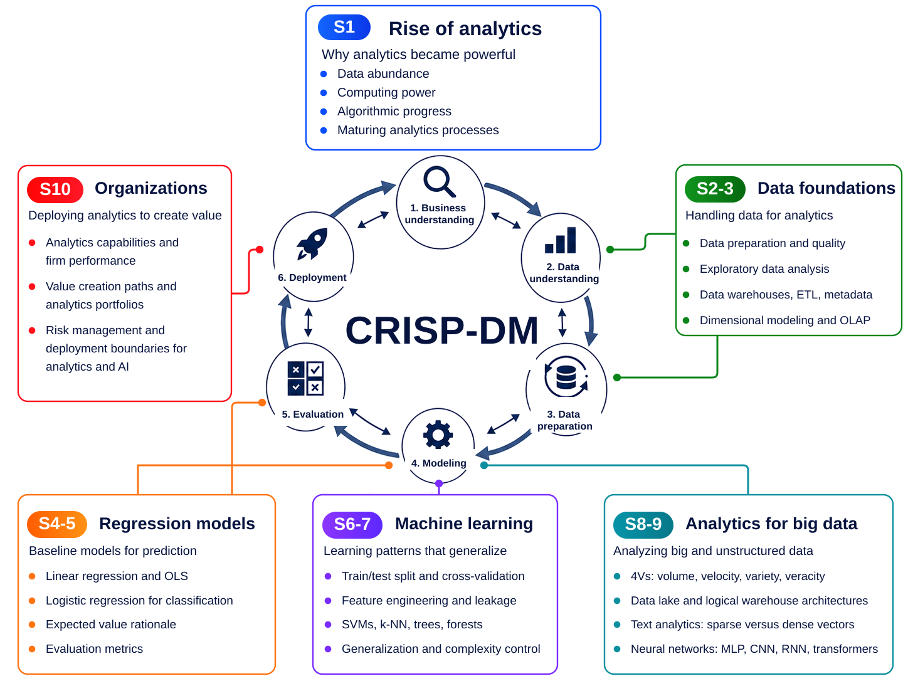
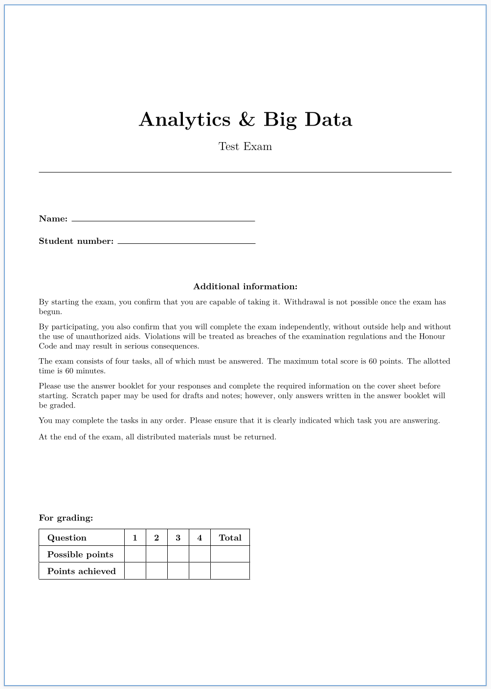

## Agenda {data-menu-title="Learning objectives" data-state="hide-menubar"}

     

- Synthesis and reflection
- Course evaluations
- Test exam
- Q&A

# Synthesis and reflection {data-stack-name="Synthesis"}

## Synthesis



## Reflection

:::: {.columns}

::: {.column width="50%"}
 
{width=100% fig-align=center}

:::

::: {.column width="50%"  style="font-size: 0.75em;"}
     
**Based on the overview figure, reflect on the course as a whole:**

1. **Where did you learn the most?**  
   Which part of the course overview represents the largest learning gain for you?

2. **What was most interesting?**  
   Which topic, method, or application would you like to explore further?

3. **What did you already know?**  
   Which concepts, tools, or perspectives were familiar to you before the course?

4. **Where do you still feel uncertain?**  
   Which part of the overview would you find hardest to explain to someone else?

5. **Where do you see the biggest gaps in the contents?**  
   Which topics should be extended, deepened, or added in a future version of the course?
:::

::::

# Course evaluations {data-stack-name="Evaluations"}

## Course evaluations {#eval-slide}

Your feedback helps improve the course, materials, and learning experience.

- Please take **10 minutes** to complete the evaluation.
- Your feedback is **anonymous**. Please be specific, honest, and constructive.

**Where to find the evaluation**

- In the **email link** you received
- In **Canvas** as a pop-up
- In the Canvas course menu: **Course Evaluation**

**Thank you for taking the time to participate!**

# Test exam {data-stack-name="Exam"}

## Test exam

{width=30% fig-align=center}

Available for download [here](https://raw.githubusercontent.com/fs-ise/analytics-and-big-data/refs/heads/main/assets/test_exam.pdf).

# Q&A {data-stack-name="Q&A"}

## Questions

**Anonymous 2320d** (2026-05-04, 4:41pm)

- How will the exam be structured? Free text and multiple choice? 
- How will the points be distributed?
- Will the exam mainly focus on the key takeaways from the slides and the key concepts? Is edge knowledge from the slides required?

## Good luck with the exam! {data-state="hide-menubar"}

 

**You are well-prepared if you can explain the main ideas, connect them across sessions, and apply them to concrete examples.**

 

::: {.columns}

::: {.column width="50%"}
**Before the exam**

- Revisit the course overview
- Review key concepts and takeaways
- Practice with the test exam
- Focus on understanding, not memorization
:::

::: {.column width="50%"}
**Stay in touch**

- Course materials  
  [Canvas course page](https://frankfurtschool.instructure.com/courses/19780)

- Interested in a thesis topic?  
  Bachelor and master theses (see SuSy)

- Questions after the course?  
  Send me an email or book a meeting

:::

:::

 

**Good luck — and thank you for participating in the course!**

{width=200px fig-align=center}