## {data-menu-title="Learning objectives" data-state="hide-menubar"}

<br><br><br>

::: {.learning-objectives}

* **Explain and interpret** the core ideas and mathematical operations underlying artificial neural networks
* **Distinguish** between major neural network architectures (MLP, CNN, RNN, TM) and identify the types of data for which they are most appropriate.
* **Understand** the design and training process of neural networks, including architecture selection and optimization.
:::

# Foundations {data-stack-name="Foundations"}

## From biological neurons to artificial neural networks

<br>

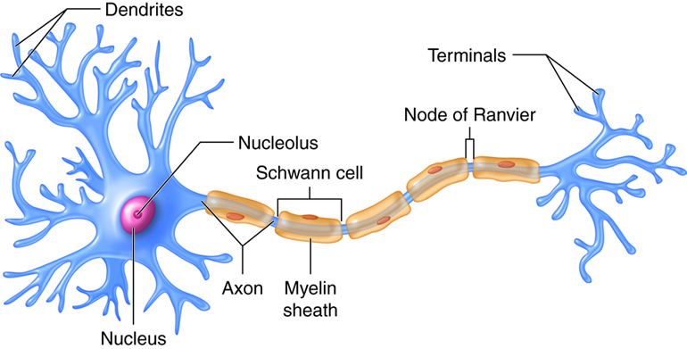{fig-align=center width=40%}

<!--
https://pressbooks.cuny.edu/sensationandperception/chapter/how-neurons-work/

TODO: replace illustration with something similar: https://iabac.org/blog/what-are-artificial-neural-networks
-->

**Key milestones**

- **1943** (Warren McCulloch & Walter Pitts) — Mathematical model of artificial neurons
- **1958** (Frank Rosenblatt) — Development of the *Perceptron*
- **2010s** (Geoffrey Hinton, Yann LeCun & Yoshua Bengio) — Revival of modern deep learning
- **2020s** (GPT models, OpenAI) — Emergence and widespread adoption of large language models (LLMs) and multimodal AI systems

::: notes
Highlight: multimodal AI (big-data) is closely connected to neural networks

Inputs correspond to dendrites, outputs to axons

The foundations of neural networks were developed 80 years ago.
Why did we have to wait for the AI breakthroughs for so long?

-> AI-Winters: 1974-1980, 1987-1993

-> availability of computing power and data (next slide) 
:::


## Performance of machine learning and neural networks

::: columns

:::: {.column width="50%"}
<br><br>
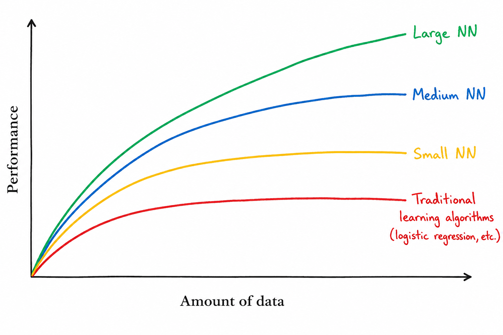{fig-align=center width=90%}

::::

:::: {.column width="50%"}

**Key drivers of recent progress in neural networks**

- Availability of large-scale datasets
- Increasing computational power (especially GPUs/TPUs)
- Advances in algorithms and neural network architectures
- Specialization of neural networks:

    - Convolutional Neural Networks (CNNs) for image and video recognition
    - Recurrent Neural Networks (RNNs) for sequential and time-series data
    - Transformers for language processing and generative AI
    - Graph Neural Networks (GNNs) for network and relational data
    - Diffusion Models for image and media generation

::::

:::

::: aside
In small-data regimes, experiments are needed to identify algorithms that perform best for a given dataset.
:::

::: notes
TPU: Tensor processing unit (for matrix and tensor operations in AI)
:::


## The perceptron

:::: {.columns}

::: {.column width="50%"}
A perceptron is one of the earliest forms of neural networks.
A **classical perceptron** is characterized by:

$$z = w^T x + b$$

followed by a **threshold activation**:

$$\hat{y} =
\begin{cases}
1 & \text{if } w^T x + b > 0 \\
0 & \text{otherwise}
\end{cases}$$

- This corresponds to a linear classifier
- The training of the perceptron consists of feeding it multiple training samples and calculating the output for each of them
- After each sample, the weights $w$ are adjusted to minimize a loss function, which quantifies the difference between the predicted and true outputs
:::

::: {.column width="50%"}
<br><br>
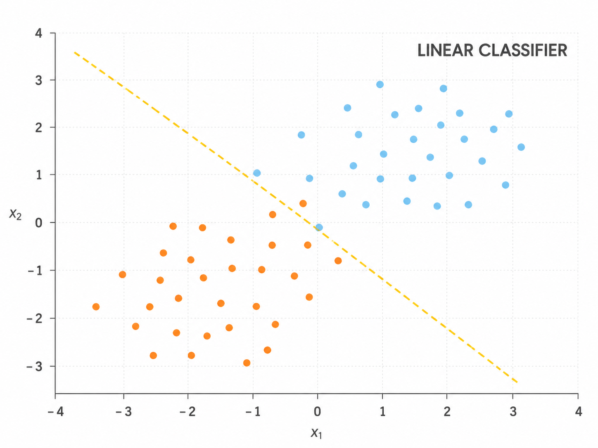{width=70% fig-align=center}
:::

::::


## From perceptron to deep neural networks

::: {.highlight_must_learn}

:::: {.columns}

::: {.column width="47%"}

Limitation of a single perceptron:
It cannot build abstract intermediate representations and can only learn linear decision boundaries.

Solution:
Multilayer neural networks combine:

- **Multiple hidden layers**, which enable increasingly abstract representations
- **Activation functions**, which make nonlinear learning possible

Layers:

- Input neurons: raw data (e.g., images, audio, video)
- Hidden neurons: the weights and biases store abstract representations learned from the data (e.g., edges, parts of an image)
- Output neuron: prediction (e.g., one neuron for binary, multiple for multi-class)

Note: the number of layers and neurons is specified ex-ante and does not change in the training process.

:::

::: {.column width="53%"}
<br><br>
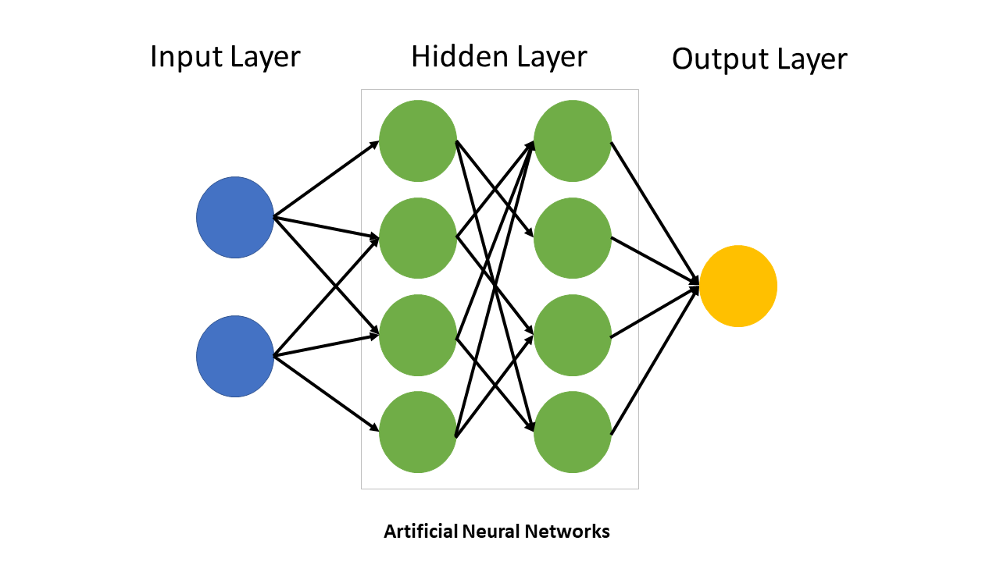
:::

::::

:::

::: {.learning_note .fragment}
🎥 Grant Anderson (3Blue1Brown) provides a series of instructive  
animated explanations, including one on [Neural Networks](https://www.youtube.com/watch?v=aircAruvnKk).
:::

## Functionality of a neuron

<br>

::: {.highlight_must_learn}

::: {style="text-align: center;"}
{fig-align=center width=65%}
:::

:::

::: aside
In a classical perceptron, the activation is typically binary (0 or 1), representing whether the neuron “fires.”  
In modern neural networks, activations are usually continuous-valued scalars determined by the activation function.
:::


## Types of activation functions

<br>

{fig-align=center width=70%}

::: aside
ReLU: Rectified Linear Unit.
:::

::: notes

Advantage of Sigmoid activation: smooth, supports gradient descent
Note: in the case of Sigmoid activation, the NN is basically a network of logistic regressions
ReLU: for efficient computation

:::

## Training of a multilayer perceptron

- Weights are initialized with carefully selected random values
- For each training item, the predicted output is calculated ("forward pass")

<br>

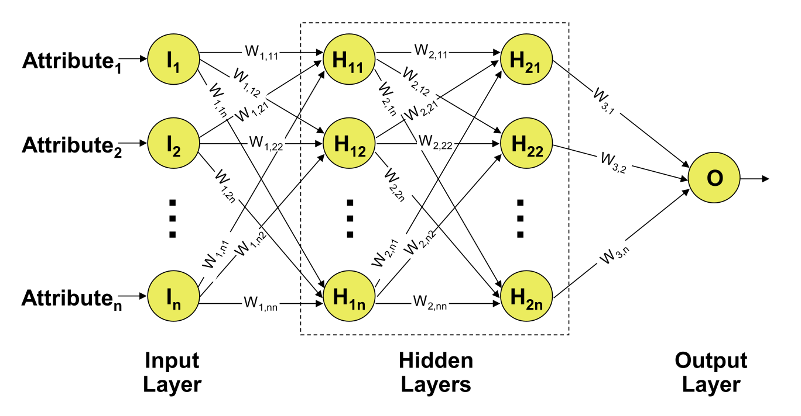{fig-align=center width=70%}


<!--
## Forward pass

TODO: illustrate the use of training data for forward pass (aside: random? initial weights, training sample i)
-->

## Loss function

:::: {.columns}

::: {.column width="50%"}
<br><br><br>

:::

::: {.column width="50%"}
The network’s prediction error is measured with a **loss function**.

For one training example $i$:

$$E_i = \frac{1}{2} \sum_{j=1}^{m} (o_{ij} - t_{ij})^2$$

This is the squared error loss across all **output neurons $j$**.

Across all $h$ training examples, the total loss is:

$$E = \sum_{i=1}^{h} E_i$$

Backpropagation adjusts the weights to reduce this total loss.
:::

::::

::: notes

The $1/2$ makes the math cleaner for the derivatives.

:::

## Backpropagation

<!--
**TODO: Cost function, Learning: gradient descent + back propagation (see slides PR)**

The Backpropagation algorithm is used for calculating the weights.
In a training phase, the weights are iteratively calculated using training data sets in such a way that the difference between the calculated and the expected (true) results is minimized.
Because the simultaneous calculation of all weights is not possible, they must be found via a learning process.
The backpropagation algorithm looks for the minimum of the cost function in weight space using the method of gradient descent.
-->

::: {.highlight_must_learn}

Backpropagation calculates the gradients of the loss function with respect to the network’s weights. These gradients are then used by an optimizer, to iteratively update the weights and reduce the difference between predicted and true outputs.

<br>

```Markdown
initialize weights and biases

repeat until stopping criterion is met:

    total_error = 0

    for each training example:

        pass input forward through all layers
        compare predicted output with target value
        add error to total_error
        propagate error backward through all layers
        update weights and biases

    check whether total_error is small enough
```
<br>
:::

<!--

The procedure in principle:

1. Define the initial weights
2. Put the training set into the input layer
3. Calculate the result (value of the output layer) via successive processing one layer after the other
4. Compare the output values and target values and calculate the difference
5. Iterate steps (2) to (4) for every training set
6. Calculate the total error. Adjust the weights beginning with the output layer towards the input layer (backpropagation)
7. Iterate steps (2) to (6) until the total error reaches the defined error-level or the number of maximum iterations is reached.
-->


## Using the loss function to adjust weights

The loss function $E$ has to be minimized.
Because it depends on the output neurons $o_j$, it automatically depends on their weights to the precedent layer(s):

$$o_j=f(s(x)_j) \text{    with    } s(x)_j =\sum_k^n w_{jk}\cdot x_k$$

Thus, the weights have to be found where $E$ is minimal.

<br>

Examples of the loss function with **two weights** (simplified):

<br>

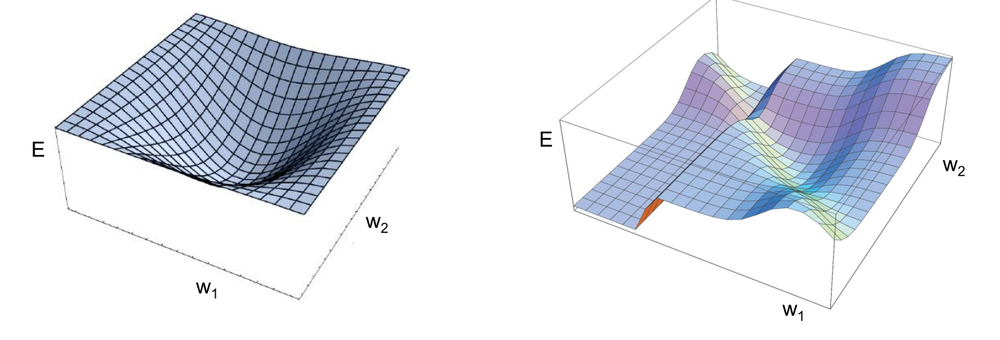{width=50% fig-align=center}

## Gradient descent

To minimize the loss function $E$ the backpropagation algorithm uses the method of gradient descent.
This method searches those weights, where the vector containing the partial first derivatives of the loss function $\nabla E$ (gradient) is equal to the zero vector (minimum):

$$
\nabla E =
\left(
\frac{\partial E}{\partial w_1},
\frac{\partial E}{\partial w_2},
\ldots,
\frac{\partial E}{\partial w_m}
\right)
$$

To adjust the weight $w_{ij}$, which connects neuron $i$ to neuron $j$, gradient descent updates the weight in the negative gradient direction:

$$
\Delta w_{ij}
= -a \cdot \frac{\partial E}{\partial w_{ij}}
$$

$$
\Delta w_{ij}
= -a \cdot \sum_{j=1}^{m}
(o_{ij} - t_{ij}) \cdot (-x_i)
= a \cdot \sum_{j=1}^{m}
(o_{ij} - t_{ij}) \cdot x_i
$$

where $a$ represents the predefined learning rate.
The adjusted weight is then computed as:

$$
w_{ij}^{\text{new}}
=
w_{ij}^{\text{old}}
+
\Delta w_{ij}
$$

. . . 

> Because neural networks have many parameters, each update changes the model in many dimensions at once.
> The learning rate therefore has to be chosen carefully: large steps can destabilize training, while very small steps can make learning inefficient.

<!--
TODO: cover example of backpropagation? http://hmkcode.github.io/ai/backpropagation-step-by-step
-->

# Specialized NNs {data-stack-name="Specialized NNs"}

<!--
> GPT is based on a huge neural network that essentially represents the language model. While the first GPT-3 has 175 billion parameters, the newer GPT-4 already has 1 trillion parameters. Compared to GPT-3, GPT-4 is therefore more intelligent, can deal with more extensive questions and conversations and makes fewer factual errors.
-->

## Overview

::: {.highlight_must_learn}

:::: {.columns}

::: {.column width="75%"}
Basic neural networks are often introduced as **fully connected feed-forward networks**.
Specialized architectures go beyond this and differ in the following design choices:

<br>
<div class="smaller">

<!--
| Design choice | What changes? | Examples |
|---|--------|----------|
| **Input structure assumed** | tabular, spatial, sequential, relational, generative/noise-to-data | images, text, time series, graphs, generated media |
| **Neuron / unit type** | dense units, recurrent cells, gates, attention heads, generator/discriminator modules | MLP, LSTM/GRU, Transformer, GAN |
| **Layer operation** | matrix multiplication, convolution, recurrence, attention, adversarial training | fully connected, conv, RNN, self-attention |
| **Connectivity pattern** | all-to-all, local windows, temporal loops, token-to-token comparison | dense layers, moving filters, hidden states, attention |
-->

| Design choice | How architectures differ |
|---|---------|
| **Input structure assumed** | Different architectures are built for different data structures, such as tabular data (MLPs), spatial data and images (CNNs), sequence data (RNNs or Transformers), relational data (graph neural networks), or ; generative tasks (GANs). |
| **Neuron / unit type** | The basic unit may be a dense neuron, recurrent cell, gated LSTM/GRU cell, attention head, or a generator/discriminator module. |
| **Layer operation** | Layers may perform matrix multiplication, convolution with moving filters, recurrent state updates, self-attention, or adversarial generator/discriminator training. |
| **Connectivity pattern** | Information may flow through all-to-all dense connections, local sliding windows, temporal loops with hidden states, or token-to-token attention. |


</div>
<br>

**Focus in this section**: We use **CNNs**, **RNNs**, and **Transformers** as key examples because they show three central architectural ideas:

- **Convolution through moving filters**
- **Memory through recurrence**, and
- **Attention**.

:::

::: {.column width="25%"}
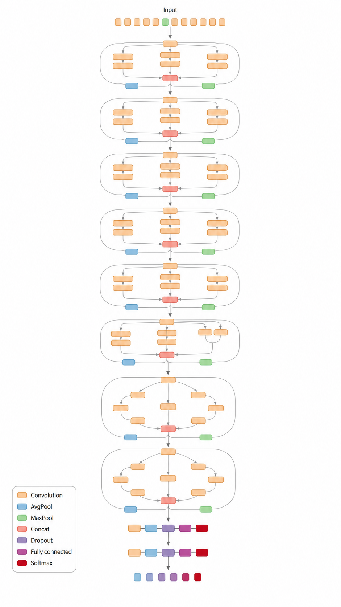
:::

::::

:::

::: notes
This slide should not present CNNs, RNNs, and Transformers as three isolated summaries. The teaching point is that specialized neural networks encode assumptions about data structure. CNNs reuse local filters over spatial data; RNNs reuse recurrent cells over time; Transformers compare tokens through attention. GANs are useful as an additional example because their specialization is not mainly a layer type, but a training setup with two networks: generator and discriminator.

Inception-ResNet-v2: coders basically build DAGs in code and generate the architecture charts as an overview.
:::


## Convolutional neural networks (CNN)

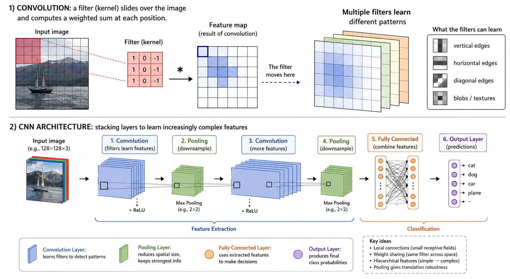{width=80% fig-align=center}

::: notes
Convolution layers: effectively multiply the number of input neurons, e.g., a 28x28x1 grayscale image with 32 filters leads to 28x28x32=25,088 activations.

TBD: similar to SVM: kernels facilitate learning in higher-dimensional transformations.
:::

## Recurrent neural networks (RNN)

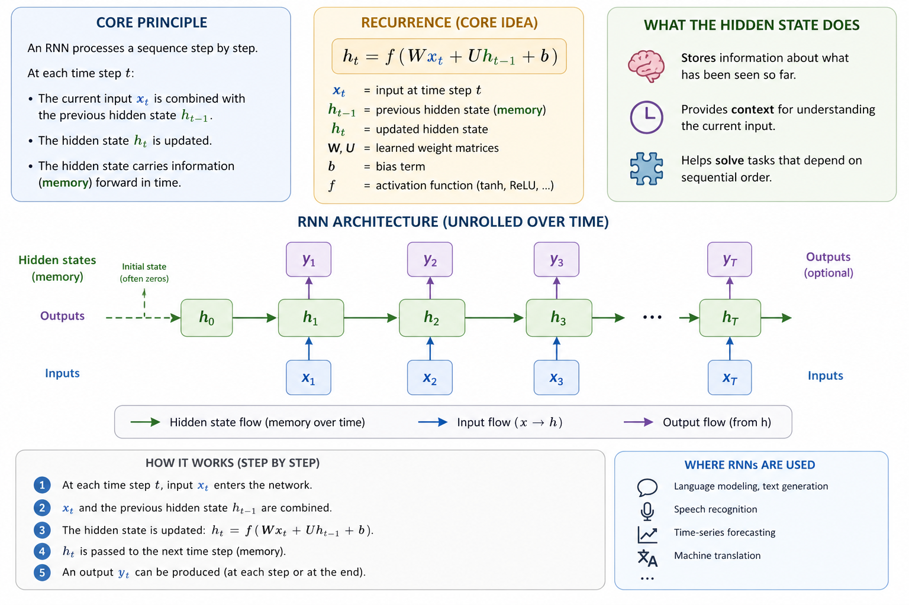{width=70% fig-align=center}

## Transformers

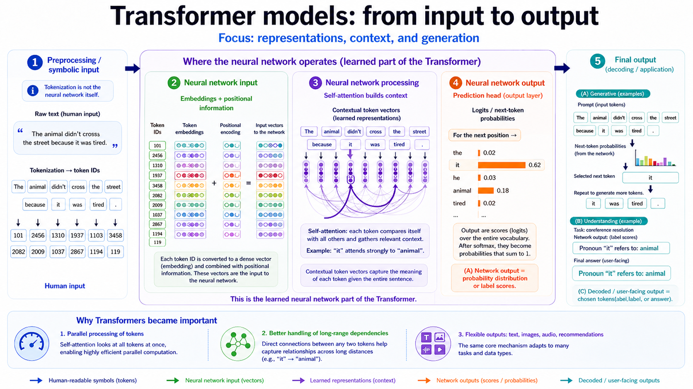{width=80% fig-align=center}

# Design and training of neural networks {data-stack-name="Design and training"}


## Modeling: choose the architecture and training setup

::: {.highlight_must_learn}

  **Best-practice logic**
Start with choices that are mostly determined by the **data structure** and the **prediction task**.  
Then tune the parts that require experimentation.


**Architecture family**

<div class="smaller">
| Data structure | Typical model | Inductive bias |
|---|---|---|
| 📊 Tabular data | MLP | fully connected |
| 📷 Images | CNN | local / spatial |
| 🎧 Audio | CNN / RNN / Transformer | local, sequential, attention |
| ⏱️ Time series | RNN / Transformer | temporal order |
| 📝 Text / language | Transformer | global attention |
</div>


<br>


**Output layer and loss function**

<div class="smaller">
| Prediction task | Output layer | Output activation | Loss function |
|---|---:|:---:|---|
| Regression | 1 neuron | Linear | MSE |
| Binary classification | 1 neuron | Sigmoid | Binary cross-entropy |
| Multi-class classification | One neuron per class | Softmax | Categorical cross-entropy |
</div>

<br>

::: {.fragment}
**Rule of thumb:** data structure determines the architecture; prediction task determines the output layer and loss.
:::


:::

## Training setup choices

::: {.highlight_must_learn}

Besides the selection of the model type, output layer, and loss function (see previous slide), these choices are usually standardized:

- **Adam** is a strong default optimizer
- Hidden layers usually start with **ReLU**

These choices require **more experimentation** to tune complexity and parameters:

::: {.columns}

::: {.column width="33%"}

::: {.design-card}
1. Network structure  
*How much can the model represent?*

**Depth**  
number of layers

- shallow → simple patterns
- deep → complex abstractions

**Width**  
neurons per layer

Typical starts:  
`32`, `64`, `128`, `256`
:::

:::

::: {.column width="33%"}

::: {.design-card}
2. Learning rate $\eta$  
*How large are the update steps?*

$$
w := w - \eta \nabla_w J
$$

- too high → unstable
- too low → slow

Typical range:  
$10^{-3}$ to $10^{-4}$

<br><br>
:::


:::

::: {.column width="33%"}

::: {.design-card}
3. Regularization  
*How do we reduce overfitting?*

- **Dropout**  
  randomly disables units
- **Weight decay**  
  penalizes large weights
- **Early stopping**  
  stops before overfitting
<br><br><br><br>

:::

:::

:::


:::

::: notes
Optimizer: updates weights (similar to  $w^{new} = w^{old} - a \cdot \frac{\partial E}{\partial w}$, but more advanced: using information from previous gradients).
:::

## Note: Neural networks and feature engineering

::: {.highlight_must_learn}

Traditional machine learning often relies strongly on **manual feature engineering**:
humans design useful input variables before training the model.
Neural networks can reduce this need because hidden layers learn **intermediate representations** from data.
However, feature engineering does not disappear. We still need to decide:

- which data are provided as input
- how inputs are encoded and normalized
- whether domain-specific variables or transformations are added

:::

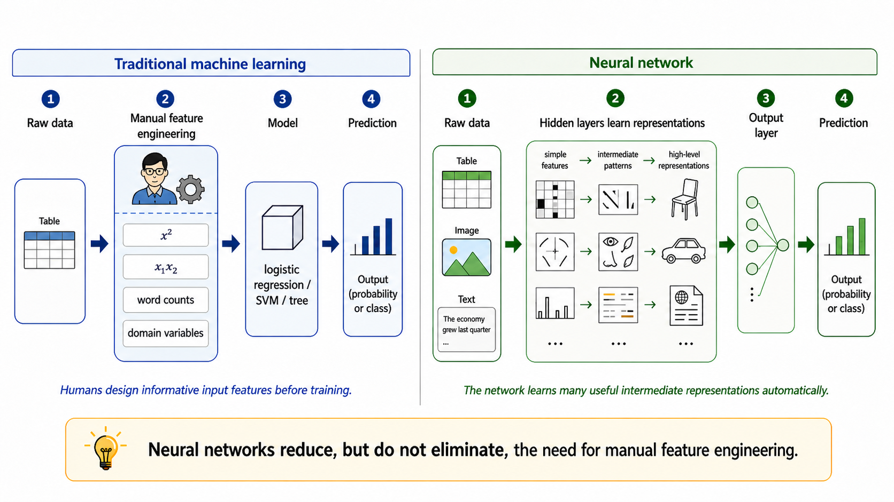{width=55% fig-align=center}

## Python code example

The `sklearn` library provides basic feedforward networks, including `MLPClassifier` and `MLPRegressor`.
It does not offer CNNs, RNNs, or other advanced neural networks.

<br>

```python
from sklearn.neural_network import MLPClassifier
from sklearn.datasets import make_classification
from sklearn.model_selection import train_test_split

X_train, X_test, y_train, y_test = train_test_split(X, y)

model = MLPClassifier(
    hidden_layer_sizes=(32, 16),  # architecture (depth + width)
    activation="relu",            # hidden activation
    solver="adam",                # optimizer
    learning_rate_init=0.001,     # learning rate
    alpha=0.0001,                 # L2 regularization (weight decay)
    max_iter=200
)
model.fit(X_train, y_train)
```

## PyTorch (I)

For advanced neural networks and production environments, `pytorch` and `tensorflow` are suitable libraries.

::: {.tall-code-box}

```{.python}
import torch

X = torch.randn(100, 10)
y = torch.sum(X, dim=1, keepdim=True)  # simple target

# TODO: specify MLP

model = MLP(
    input_dim=10,
    hidden_layers=[32, 16],   # try: [8], [64, 64], [128, 64, 32]
    output_dim=1              # regression
)

# Training setup
criterion = nn.MSELoss()   # regression
learning_rate = 1e-3       # try: 1e-1, 1e-4
optimizer = torch.optim.Adam(model.parameters(), lr=learning_rate)

# Training loop
for epoch in range(100):

    predictions = model(X)  # Forward pass
    loss = criterion(predictions, y)

    # Backpropagation
    optimizer.zero_grad()
    loss.backward()
    optimizer.step()

    print(f"Epoch {epoch}, Loss: {loss.item():.4f}")
```
:::

::: notes
The architecture (whether it is a CNN/RNN/Transformer/... is not specified as a parameter, but implied by the design of layers).
:::

## PyTorch (II)

::: {.tall-code-box}
```python
import torch.nn as nn

# Specify MLP
class MLP(nn.Module):
    def __init__(self, input_dim, hidden_layers, output_dim):
        super().__init__()

        layers = []
        prev_dim = input_dim

        # Depth and width
        for h in hidden_layers:
            layers.append(nn.Linear(prev_dim, h))
            layers.append(nn.ReLU())
            prev_dim = h

        layers.append(nn.Linear(prev_dim, output_dim))

        self.model = nn.Sequential(*layers)

    def forward(self, x):
        return self.model(x)

# ...
model = MLP(
    input_dim=10,
    hidden_layers=[32, 16],
    output_dim=1
)

```
:::

::: aside
See the torch [Module](https://docs.pytorch.org/docs/2.11/generated/torch.nn.Module.html) for inherited methods.
:::

## Summary {data-state="hide-menubar"}

- Neural networks transform inputs into outputs through **weighted connections**, **biases**, and **activation functions**.  
  A single perceptron can only learn **linear decision boundaries**; multilayer networks with nonlinear activations can model more complex patterns.

- Training consists of a **forward pass**, loss calculation, **backpropagation**, and parameter updates via an optimizer such as gradient descent or Adam.

- Different neural network architectures encode different assumptions about data:  
  **MLPs** for tabular data, **CNNs** for spatial data, **RNNs** for sequences, and **Transformers** for attention-based language tasks.

- Designing neural networks means choosing the architecture, output layer, loss function, learning rate, optimizer, and regularization strategy, then iteratively evaluating and adjusting these choices.

## Survey: Session 9 {data-state="hide-menubar"}

<br><br>

::: {style="display:flex; justify-content:center;"}

" width=400 height=400 >}}

:::

<br><br>

[]()

::: aside
Note: Responses may be analyzed and published in anonymized form.

Please complete the survey before you leave today — thank you 🙏
:::


# References {data-state="hide-menubar"}