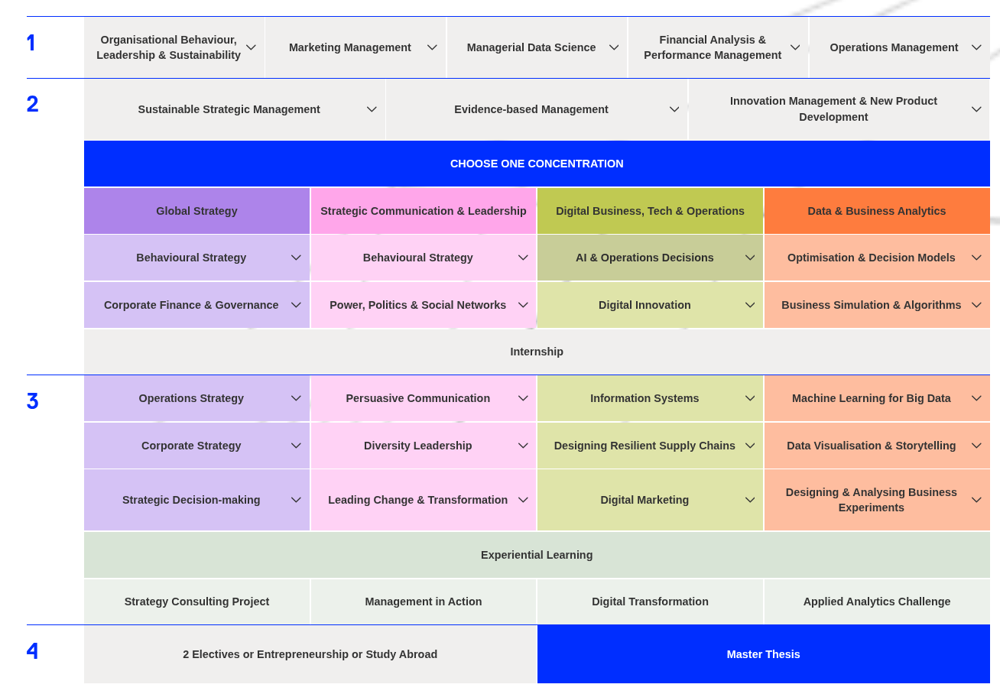

# Welcome {data-stack-name="Welcome"}

## Prof. Dr. Gerit Wagner

::: {.columns}
::: {.column width="70%"}

Academic background

- Universität Regensburg: Doctoral Student
- HEC Montréal: Postdoctoral Fellowship
- Otto-Friedrich-Universität Bamberg: Assistant Professor
- Frankfurt School of Finance & Management: Full Professor

Research interests

- Open, agentic, and boundary-spanning work
- AI-supported knowledge synthesis

Teaching interests

- Analytics and big data
- IT security
- Programming and software engineering
- Digital knowledge-intensive and platform-based work
- Literature review methods

:::

::: {.column width="30%"}

:::
:::

## About you

<!--
For smaller courses (approx. 15 students):

Please answer the three questions.
Then choose **one** optional area where you would like to share a bit more.

HIGHLIGHT items as optional
-->

Please take a moment to think about the following questions.
For each question, I’ll invite a few of you to briefly share your thoughts.

 

**1. Have you worked in an industry role or completed an internship with an analytics focus?**

- What was something that felt **very useful** in your analytics work?
- Or where would you have liked to be **better prepared** for a data-related task?

**2. Which analytics tools or programming languages have you used?**

- What was a particularly interesting analytics **challenge** you encountered?
- Or a tool you found especially powerful or **surprising**?

**3. What are your expectations for the course?**

<!--
  - What do you want to be able to do by the end of this course?
  - What would make this course “worth it” for you?
-->

# Machine Learning for Big Data {data-stack-name="Machine Learning for Big Data"}

## Machine Learning for Big Data in the curriculum

{.absolute top=200 left=300 width="800" }

## Course architecture

**1. Introduction to Big Data**

**2. Data Foundations**

**3. Methods, Algorithms, and Applications**

- Baseline Models
- Machine Learning for Structured Data
- Machine Learning for Unstructured Data

**4. Deployment in Organizations**

## What this course does *not* cover

- **Engineering of production-grade analytical systems**

  - Software engineering
  - Database design
  - DevOps/MLOps pipelines
  - Scalable application development

- **Statistical theory**

  - Inferential statistics
  - Proofs/derivations

- **Mathematical optimization and simulation models**

  - Scheduling, logistics, queueing

- **Autonomous or agentic decision systems**
 
  - Robots/agents acting on decisions
  - Reinforcement learning

 We will *touch* these areas where needed, but our focus is on **analytical reasoning for business decisions**  and **notebook-based implementations**.

# Course logistics  {data-stack-name="Course logistics"}

## Course logistics

Workload:

* 150 h total
* 44 academic teaching hours (45 minutes each)
* Remaining workload: self-study, including lesson preparation and follow-up, reading, assessment preparation, and take-home assignments

Assessment:

* Group project: ongoing, submitted as a text document at the end of the module
* 120 performance points

Sessions:

* See overview in Canvas

Contact:

- Instructor: [](){target="_blank"} ([](mailto:))
- Office hours: see [bookings](){target="_blank"}

Individual circumstances

If you have family responsibilities, religious holidays, health-related matters, or other individual circumstances that may affect your participation or performance, please reach out early.
We will work together to find a fair and workable solution.

# TODO: `group-projects/Guidelines for the GroupProjects.pdf`

## Materials

Slides and materials

- Presentation slides and notebooks will be made available for download.

Short surveys at the end of each session

- If you notice anything that could benefit from further clarification or improvement, please take a note and let me know there.

Your input makes a real difference 🙏

. . . 

 

Learning markers

- Facilitate learning and exam preparation.
- Help distinguish between illustrative material and key concepts and skills to prioritize.

::: {.highlight_must_learn}

**Key concepts**

These markers highlight key skills and knowledge areas that you should prioritize when preparing for the exam.
 
*Note*: This does not mean that other contents are excluded—they remain relevant for a complete understanding.

:::

::: {.learning_note}

**Learning focus**

These notes indicate how the content may be addressed in the exam and how you can prepare effectively.

:::

## Literature

- You are expected to take complementary notes and read the recommended literature.
<!-- - You can contribute directly to the [teaching materials](https://github.com/fs-ise/big-data-analytics) by submitting an issue ♻️ or suggesting edits 🛠️. -->
- Literature and complementary materials will be listed at the end of each lecture.
- Reading of complementary materials depends on your interest and ambition.

<!-- - Materials will be made available whenever possible. -->

**General Introduction**

- Alpaydin [-@Alpaydin2016NewAI]
- Schutt and O'Neil [-@SchuttONeil2013]
- Schmarzo [-@Schmarzo2016]

**Methods and Algorithms**

- Alpaydin [-@Alpaydin2016IntroML]
- Hastie, Tibshirani, and Friedman [-@HastieTibshiraniFriedman2009]
- James et al. [-@JamesWittenHastieTibshirani2013]

## You may also be interested in ... {data-state="hide-menubar"}

:::: {.columns}

::: {.column width="55%"}
Master's theses: See [SuSy](https://susy.frankfurt-school.de/) and additional information on [this page](https://fs-ise.github.io/theses/).

In SuSy, you can find more information on my research topics:

- **Open, Agentic, and Boundary-Spanning Work**  
  This area examines how AI agents and open digital infrastructures reshape knowledge work and collaboration across organizational boundaries.
  It focuses on agentic systems embedded in real work contexts (e.g., Git workflows, handbooks, and repositories) and how they transform coordination, governance, and accountability.
- **AI-Supported Knowledge Synthesis**  
  This area investigates how AI supports knowledge synthesis across academic and professional contexts, focusing on transparency, rigor, and traceability in AI-assisted processes.
  It includes literature reviews and synthesis in digital gardens, second-brain systems, and other knowledge repositories.

:::

::: {.column width="45%"}
    

{width=70% fig-align=center}
:::

::::

# References {data-state="hide-menubar"}