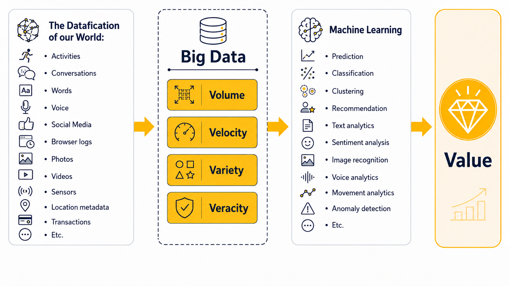
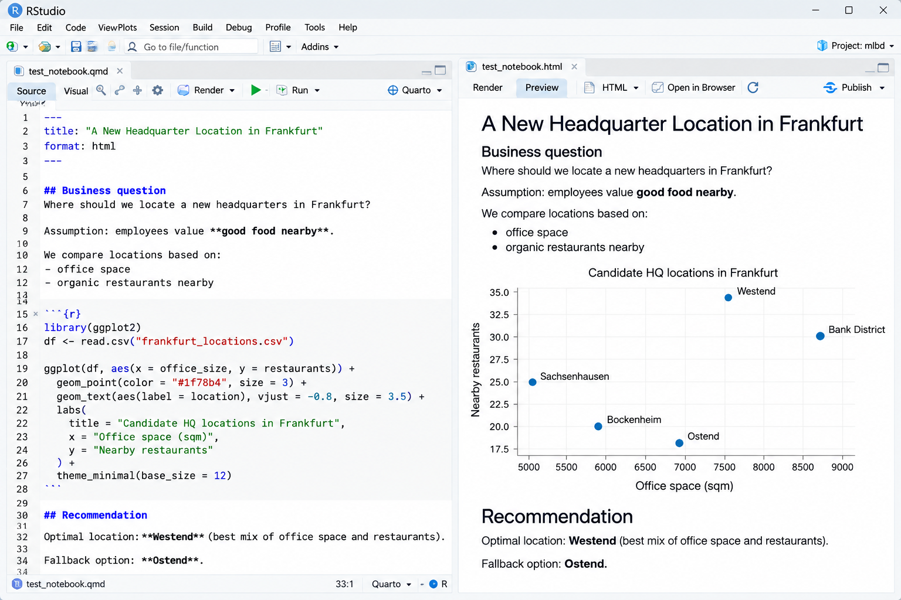

## {data-menu-title="Learning objectives" data-state="hide-menubar"}

<br><br><br><br><br>

::: {.learning-objectives}
- **Describe** the growth and principal sources of large-scale data.
- **Explain** the four characteristics of big data and their business implications.
:::

# The growth of data {data-stack-name="Growth of data"}

## The exponential growth of data

::: columns

:::  {.column width="50%"}

<br><br>

```{python}
#| echo: false

import matplotlib.pyplot as plt
import numpy as np

# Known datapoints from literature (IDC Global Datasphere summaries)
years_known = np.array([2010, 2012, 2014, 2016, 2018, 2020, 2022, 2024, 2025])

structured_known = np.array([0.6, 1.0, 1.6, 3.8, 7, 12, 18, 26, 32])
unstructured_known = np.array([1.4, 2.5, 4.4, 12.2, 26, 52, 79, 121, 149])

# Sources referenced in literature:
#
# - Global data volume was ~2 ZB in 2010
# - It increased to ~33 ZB by 2018
# - IDC Global Datasphere reports forecast ~175 ZB by 2025
# - Some summaries report ~181 ZB by 2025
#
# These figures illustrate strongly exponential growth.

# Create full yearly range
years = np.arange(2010, 2026)

# Interpolate missing years
structured = np.interp(years, years_known, structured_known)
unstructured = np.interp(years, years_known, unstructured_known)

totals = structured + unstructured

# Identify interpolated years
is_interpolated = ~np.isin(years, years_known)
is_known = np.isin(years, years_known)

# Fit exponential trendline
log_totals = np.log(totals)
coeffs = np.polyfit(years, log_totals, 1)
trend_raw = np.exp(np.poly1d(coeffs)(years))

# Scale trend so it reaches ~190 ZB in 2025
target_2025 = 190
scale_factor = target_2025 / trend_raw[years == 2025]
trend = trend_raw * scale_factor

plt.figure(figsize=(9,4))

# --- Structured data bars ---
plt.bar(
    years[is_known],
    structured[is_known],
    label="Structured data"
)

plt.bar(
    years[is_interpolated],
    structured[is_interpolated],
    color="gray",
    hatch="//"
)

# --- Unstructured data bars ---
plt.bar(
    years[is_known],
    unstructured[is_known],
    bottom=structured[is_known],
    label="Unstructured data"
)

plt.bar(
    years[is_interpolated],
    unstructured[is_interpolated],
    bottom=structured[is_interpolated],
    color="gray",
    hatch="//"
)

# Exponential trendline
plt.plot(years, trend, color="black", linewidth=2, label="Estimated exponential trend")

plt.xlabel("Year")
plt.ylabel("Zettabytes")
plt.title("Growth of Global Data Volume")

plt.xticks(years, rotation=45)
plt.grid(axis="y")

plt.legend()

plt.show()
```

:::

:::  {.column width="50%"}

<br><br>

| Unit | Equivalent | Approximate meaning |
|-----|------------|---------------------|
| Gigabyte (GB) |  | A HD movie file or a few hundred photos |
| Terabyte (TB) | 1,000 GB | Storage of a modern laptop or external drive |
| Petabyte (PB) | 1,000 TB | Data of a large company or several large data centers |
| Exabyte (EB) | 1,000 PB | Roughly the yearly internet traffic of a small country |
| Zettabyte (ZB) | 1,000 EB | ≈ 1 trillion gigabytes; global data creation scale |

:::

:::

## Data production

**Enterprise and transactional data**<br>
Enterprise systems such as ERP, CRM, and supply chain platforms generate large volumes of structured data through everyday business transactions.

**E-commerce**<br>
Every search, click, purchase, and review creates behavioral and transactional data used for recommendations and personalized marketing.

**Social media and user-generated content**<br>
Platforms such as TikTok, YouTube, and Instagram generate enormous data volumes through uploads, interactions, and live-streaming.

**IoT and smart devices**<br>
Connected devices—from wearables to industrial sensors—continuously produce real-time data across interconnected systems.

**Digital transactions**<br>
Online banking, mobile payments, and blockchain systems generate detailed financial records for transactions and security monitoring.

**AI-generated data**<br>
Machine learning and generative AI create large datasets during training and operation, further accelerating global data growth.


# Defining big data {data-stack-name="The 4V Model of big data"}

## The 4 V’s of big data

Big data matters when the **properties of the data** change what managers can decide, automate, or compete on.

::: {.highlight_must_learn}

{fig-align="center" width="70%"}

:::


::: notes
Rationale and key points to cover:

This opening slide should shift the students away from the generic definition of big data as "lots of data." The key teaching message is that each V corresponds to a different managerial dilemma.

Volume is not just about storage; it is about decision complexity. Velocity is not just about speed; it is about making a decision while the event is still unfolding. Variety is not just about having structured and unstructured data; it is about integrating data worlds that were previously separate. Veracity is not just about data quality; it is about whether managers can trust what the data appears to say.

Use this as the conceptual frame for the four business examples that follow.
:::


# Examples of big data in different industries {data-stack-name="Industry examples"}

## Volume: UPS route optimization

::: columns
::: {.column width="55%"}

**Analytical question**

How do you optimize millions of delivery decisions when every route has thousands of possible variants?

**Key data facts**

- 250M+ address data points
- 200,000+ route options per typical route
- Parcels, drivers, fleet, road network, customer constraints
- Real-time updates from operations and telematics

**Models:** vehicle routing · scheduling · ETA prediction · dynamic re-optimization<br>
**Outcomes:** fewer miles · lower fuel costs · better on-time delivery · operational data advantage

:::

::: {.column width="45%"}

{fig-alt="UPS delivery truck or route optimization image" width=450px}

:::
:::


::: notes
Rationale and key points to cover:

This slide illustrates volume as operational complexity. The point is not merely that UPS has "a lot of data." The deeper point is that parcel logistics creates an enormous number of possible decisions: which parcels go into which vehicle, in which order, driven by which driver, through which road network, under which delivery and pickup constraints.

Emphasize that a route is not simply a map from A to B. It includes today’s parcels, promised delivery windows, pickup commitments, driver constraints, fleet capacity, customer requirements, historical travel times, current network conditions, road restrictions, and operational updates during the day.

The analytical problem is therefore combinatorial. A human dispatcher cannot compare hundreds of thousands of possible stop sequences. The firm needs optimization models, routing heuristics, scheduling systems, and ETA prediction. More advanced versions also support dynamic re-optimization when traffic, delays, or operational disruptions occur.

The competitive implication is that small improvements per route become enormous at system scale. Saving a few minutes or a few kilometers per driver per day can translate into major annual savings in fuel, labor, emissions, and service reliability. This creates an operational data advantage: firms with richer route histories, denser delivery networks, and better optimization infrastructure can operate at lower cost and higher reliability.

References for data and claims:

- UPS ORION materials describe large-scale route optimization using more than 250 million address data points and evaluating more than 200,000 route options for a typical route.
- UPS has reported ORION-related savings on the order of 100 million miles and around 10 million gallons of fuel per year.
- Useful source search terms: "UPS ORION 250 million address data points", "UPS ORION 200,000 route options", "UPS ORION 100 million miles 10 million gallons".
:::


## Velocity: Visa fraud detection

::: columns
::: {.column width="55%"}

**Analytical question**

Can fraud be detected **before** the transaction is approved?


**Key data facts**

- Up to **83,000 transactions / second**
- ≈ **7.17B decisions / day** at peak capacity
- 500+ data points per transaction
- Fraud is rare, but losses are massive
- Visa reported **$40B+ fraud blocked in 2023**


**Models:** real-time risk scoring · anomaly detection · streaming ML · network analysis<br>
**Outcomes:** approve · decline · challenge · escalate — all within milliseconds
:::

::: {.column width="45%"}

{fig-alt="Digital payment or fraud detection image" width=450px}

:::
:::

::: notes
Rationale and key points to cover:

This slide illustrates velocity as the need to decide while the business event is still happening. In payment fraud detection, the decision must be made before the customer leaves the checkout page or terminal. The system cannot wait for an overnight batch report.

The key teaching point is the millisecond decision window. The model must ingest transaction data, compare it against historical patterns, evaluate location, merchant, amount, device, account history, and behavioral signals, and then decide whether the transaction should be approved, declined, challenged, or escalated.

This is also a useful example of rare-event analytics. Fraudulent transactions may be a tiny share of all transactions, but at Visa scale even a very small percentage can imply very large losses. False positives also matter: blocking genuine customers damages trust, merchant revenue, and user experience. The analytical challenge is therefore not simply "detect fraud"; it is "detect fraud while minimizing false declines, in milliseconds, at massive scale."

The models typically include supervised machine learning, anomaly detection, streaming analytics, graph and network analysis, and real-time decision rules. The models are embedded directly in the transaction infrastructure.

The competitive implication is trust. Payment networks compete partly on reliability, fraud protection, authorization quality, and customer experience. Better fraud analytics can reduce losses, increase legitimate approval rates, and make merchants and banks more willing to rely on the network.

References for data and claims:

- Visa reports infrastructure capacity of up to 83,000 transactions per second.
- 83,000 × 86,400 seconds per day = 7,171,200,000 theoretical peak transaction decisions per day.
- Visa describes using 500+ data points in fraud detection and reported blocking over $40 billion in fraud in 2023.
- ECB/EBA payment fraud reports can be used to illustrate that fraud rates are small as a percentage of transaction value but still correspond to billions in absolute losses.
- Useful source search terms: "Visa 83,000 transactions per second", "Visa 500 data points fraud", "Visa blocked 40 billion fraud 2023", "ECB EBA payment fraud 2024 0.002 percent".
:::


## Variety: Walmart ambient IoT supply chain

::: columns
::: {.column width="55%"}

**Analytical question**

How do you coordinate inventory when the relevant data comes from many different worlds?

**Key data facts**

- Target: **90M pallets** by end of 2026
- Active in **500 Walmart locations**
- Potential scale: 4,600 stores + 40+ distribution centers
- Sensor data: location, movement, temperature, humidity, dwell time
- Combined with inventory, supplier, store, and replenishment data

**Models:** sensor fusion · demand forecasting · replenishment optimization · exception detection<br>
**Outcomes:** fewer stockouts · fresher products · less waste · tighter supplier coordination
:::

::: {.column width="45%"}

{fig-alt="Retail supply chain or IoT pallet tracking image" width=450px}

:::
:::

::: notes
Rationale and key points to cover:

This slide illustrates variety as the integration of heterogeneous data worlds. Walmart’s supply-chain example is useful because the relevant data are not all in one system. They come from physical pallets, ambient IoT sensors, store inventory systems, supplier systems, distribution centers, transport flows, and AI-based replenishment systems.

The important teaching point is that the same business object—the pallet—becomes a digital object. It can produce information about where it is, how long it has been there, whether it was exposed to temperature or humidity deviations, and whether it is moving through the supply chain as expected.

This is especially important for food and grocery supply chains, where freshness, waste, stockouts, and timing matter. Data variety allows Walmart to connect physical product flow with digital planning and replenishment decisions.

Typical analytical models include sensor fusion, demand forecasting, replenishment optimization, dwell-time analytics, exception detection, and cold-chain monitoring. More advanced versions can be described as supply-chain control towers or digital twins.

The competitive implication is coordination. Walmart can use these data not only internally but also to structure supplier behavior. The firm gains better visibility over inbound flows, supplier performance, inventory accuracy, and store-level availability. This can reduce waste, improve freshness, reduce stockouts, and strengthen Walmart’s cost and availability advantage.

References for data and claims:

- Wiliot announced collaboration with Walmart to scale ambient IoT tracking toward 90 million pallets by the end of 2026.
- Wiliot/Walmart materials mention deployment across hundreds of Walmart locations and potential expansion across Walmart’s store and distribution-center network.
- Wiliot describes ambient IoT sensors collecting location and condition data such as temperature and humidity.
- Useful source search terms: "Wiliot Walmart 90 million pallets 2026", "Walmart ambient IoT pallets 500 locations", "Wiliot Walmart temperature humidity pallets".
:::


## Veracity: Digital advertising fraud

::: columns
::: {.column width="55%"}

**Analytical question**

The dashboard says there were clicks and impressions — but were they real?

**Key data facts**

- Fraudulent impressions, clicks, conversions, or data events
- DoubleVerify measures **8.3T+ media transactions / year**
- Ad fraud losses projected at **$172B by 2028**
- One fraud operation fell from **2.5B** to **100M** daily bid requests after mitigation

**Models:** bot detection · invalid traffic scoring · anomaly detection · graph analysis<br>
**Outcomes:** block fake traffic · clean attribution · reallocate spend · protect ROI
:::

::: {.column width="45%"}

{fig-alt="Digital advertising fraud or bot traffic image" width=450px}

:::
:::


::: notes
Rationale and key points to cover:

This slide illustrates veracity: whether the data can be trusted. Digital advertising is a strong example because the data may look extremely precise. A dashboard can report impressions, clicks, conversions, engagement rates, and cost per acquisition. But the central managerial question is whether these events reflect real human attention and real customer intent.

This is a better teaching example than a simple sensor failure because the ambiguity is managerial and economic. A click may exist in the data but still be generated by a bot. An impression may be counted but never actually seen by a human. A conversion may be attributed to a campaign but be manipulated by fraud or poor measurement.

The analytical models include bot detection, invalid-traffic classification, anomaly detection, device and behavioral fingerprinting, graph analysis, publisher-quality scoring, and campaign-level traffic-quality models.

The decision consequences are significant. Advertisers may block traffic, exclude publishers, shift budgets, reprice impressions, revise attribution models, or stop campaigns. Without veracity, the organization may optimize toward fake engagement. This is a powerful teaching point: bad data can make analytics actively harmful because the model learns from signals that do not correspond to real business value.

The competitive implication is marketing efficiency and trust. Firms with better traffic-quality analytics can spend advertising budgets more effectively, avoid waste, protect brands, and build more reliable attribution systems.

References for data and claims:

- IAB defines ad fraud and invalid traffic as fraudulent representation of impressions, clicks, conversions, or other data events.
- DoubleVerify reports measuring over 8.3 trillion media transactions annually.
- DoubleVerify cites Juniper estimates that global ad fraud losses could reach $172 billion by 2028.
- HUMAN Security reported mitigation of a fraud operation that reduced activity from 2.5 billion daily bid requests to 100 million daily bid requests.
- Useful source search terms: "IAB ad fraud invalid traffic impressions clicks conversions", "DoubleVerify 8.3 trillion media transactions", "Juniper ad fraud 172 billion 2028", "HUMAN 2.5 billion daily bid requests 100 million".
:::


## Metadata: Location intelligence

::: columns
::: {.column width="55%"}

**Analytical question**

How can organizations reconstruct **where devices have been, when, and with whom they co-located** from billions of metadata observations?

**Key data facts**

- Persistent device or advertising identifier
- **Timestamp + latitude + longitude**
- Continuous streams create detailed movement histories
- Billions of small observations can accumulate rapidly
- Metadata can reveal routines and relationships **without recording content**

**Models:** spatio-temporal indexing · geofencing · trajectory analysis · clustering · network analysis<br>
**Outcomes:** recommend location-specific products and services · personalize offers · optimize site selection · analyze mobility patterns · support real-time decisions

:::

::: {.column width="45%"}

{fig-alt="Map showing time-stamped device locations and movement trajectories" width=450px}

:::
:::

::: notes
Rationale and key points to cover:

This example illustrates that big data does not necessarily mean large individual files. Location metadata records can be extremely small: an identifier, a timestamp, and geographical coordinates. At scale, however, continuously collecting these observations produces enormous datasets.

For businesses, these data support applications such as recommending location-specific products and services, personalizing offers, analyzing customer mobility, selecting store locations, estimating foot traffic, optimizing logistics, and adapting services in real time.

The analytical value comes from combining geography and time. A sequence of observations can reconstruct movement trajectories, recurring locations, routines, and co-location with other devices. Importantly, such inferences can often be made without accessing communication content.

This creates distinctive storage and processing challenges. Systems need to support queries combining both space and time across billions of observations. Specialized data structures and techniques therefore become important, including spatial indexes such as R-trees, geographical partitioning using geohashes or H3 cells, time partitioning, columnar storage, compression, and distributed stream processing.

The broader industry spans several overlapping areas. Firms such as Palantir provide platforms for integrating and analyzing large heterogeneous datasets, while companies such as Fog Data Science, Babel Street, Venntel, and Gravy Analytics have offered more specialized location- or device-data capabilities.

These markets overlap with what is sometimes critically described as the **surveillance industry**. The same general capabilities—combining location data, identifiers, temporal histories, and other metadata—can be used for commercial location analytics, but also for intelligence, law-enforcement, and other government applications.

The important distinction is therefore often not the underlying data structure or analytical technique, but the purpose, customer, governance regime, and consequences of its use.

The broader teaching point is that metadata can become "big data" through granularity, temporal depth, and scale. The individual observation contains little information, but billions of interconnected observations can reveal highly detailed behavioral patterns.
:::


# Defining big data {data-stack-name="Clarifying the 4V model"}

## Critically analyzing examples of Big Data

 **Discuss with your neighbor (3–4 min)**

Revisit the examples from the previous slides and add **one or two examples of your own**.

For each case, consider:

- Which of the **four V dimensions** does it exhibit?
- Which dimensions are particularly **strong or weak**?
- Are there examples that clearly exhibit **all four Vs**?
- **Do Big Data need to satisfy all four Vs?**

 Be prepared to share **one interesting or ambiguous case**.


## Are all Vs necessary for Big Data?

@kitchin_big_2016 examined **26 datasets** commonly described as Big Data across seven domains.

. . .

Their findings challenge a simple V-based checklist:

- Only a **handful** of datasets exhibited all of the characteristics they examined.
- Even **volume and variety were not necessary conditions**.
- **Velocity and exhaustivity** emerged as the strongest boundary markers distinguishing Big Data from small data.

. . .

::: {.callout-tip}
## Key takeaway

**Big Data is not simply "very large data."**

It is better understood as a **combination of characteristics** rather than as data that must satisfy every V.
:::

<!--

**Kitchin, R., & McArdle, G. (2016). “What makes Big Data, Big Data? Exploring the ontological characteristics of 26 datasets.” *Big Data & Society, 3*(1).** DOI: `10.1177/2053951716631130`.

It explicitly asks whether Big Data datasets need to exhibit the various defining characteristics. The authors analyze **26 datasets** against seven Big Data traits and conclude:

> “there is no one characteristic profile that all Big Data fit.”

More specifically, they find that **not even all of the classic 3Vs—volume, velocity, and variety—need to be present**. Only a handful of their datasets exhibited all seven characteristics.

Their stronger conclusion is particularly useful for teaching:

* Big Data should possess a **majority** of the relevant characteristics.
* **Velocity and exhaustivity** are, in their analysis, the most important boundary characteristics.
* **Volume and variety are explicitly *not* necessary conditions** for something to constitute Big Data.

See: https://journals.sagepub.com/doi/10.1177/2053951716631130 "What makes Big Data, Big Data? Exploring the ontological characteristics of 26 datasets - Rob Kitchin, Gavin McArdle, 2016"

-->

## Summary {data-state="hide-menubar"}

- Data volumes and sources have expanded rapidly, creating new analytical opportunities.
- Volume, velocity, variety, and veracity create distinct analytical and managerial challenges.
- Big-data applications combine different forms of data and machine learning models to create business value.

. . . 

{fig-align="center" width="65%"}

<!--
based on : http://de.slideshare.net/BernardMarr/140228-big-data-slide-share/3-The_basic_idea_behind_the
-->

# Analytical setup {data-stack-name="Analytical setup"}

## Setup for the practical exercises

:::: {.columns}

::: {.column width="40%"}

**Options**

- Microsoft Excel
- Microsoft Power BI
- IBM SPSS Statistics
- RapidMiner
- Tableau
- Python
- **R + RStudio + Quarto**

:::

::: {.column width="60%" .fragment}

**Why this setup?**

We use **R, RStudio, and Quarto** because

- they support **advanced analytics**, including data preparation, visualization, statistical modeling, and machine learning
- working with code provides a **transparent and reproducible analytical workflow**
- R is **widely used in analytics and research**
- Quarto combines **context, code, explanations, results, and implications in a single document**
- the skills transfer well to other analytical tools and programming environments

:::

::::


## Our analytical environment

:::: {.columns}

::: {.column width="35%"}

**R**

Executes the analytical code.

**RStudio**

Provides the development environment for

- writing and running R code
- inspecting data and objects
- managing files and projects
- working with Quarto documents

**Quarto**

Combines text, code, results, tables, and visualizations into a reproducible analytical document.

 In this course, the Quarto document is the central analytical artifact.

:::

::: {.column width="64%"}

{width=100% .boxed-image fig-align=center}

:::

::::

::: notes
A Quarto document combines context, code, output, and implications in one reproducible analysis.

Document elements

Markdown → explanations, documentation, and interpretation
R code chunks → data preparation and analysis
Output → tables, statistics, and visualizations
:::

## Local setup

Please install **RStudio Desktop** on your computer.

Then verify your setup:

1. Open RStudio.
2. Create a new Quarto document.
3. Select **R** as the computation engine.
4. Add and execute an R code chunk.
5. Render the document.


 If the code executes and the document renders successfully, your analytical environment is ready.

::: aside

You may need to install `rmarkdown`:

```r
install.packages("rmarkdown")
```

:::

## Practical exercise: Start your Quarto analysis

Work in pairs.

This exercise can also serve as a **first exploration of a possible group project topic**.

**Base task**

- Create a Quarto document called `report.qmd`.
- Select a suitable dataset from [Kaggle](https://www.kaggle.com/datasets) and download it as CSV.
- Add a short **analytical or business question** to your document.
- Import the CSV file into R.
- Display the first rows using `head()`.
- Briefly describe:
  - which analytical methods could be applied,
  - which variables would be relevant,
  - and what kinds of insights the analysis could potentially produce.
- Render the document as **HTML**.

 The goal is to create a **small but complete reproducible analysis document**, not to perform the full analysis.

::: aside

If you have a question, put up the **help-needed** tag and I will come by.

:::

## Optional extensions

- Create a **scatterplot** with `ggplot2` and hide the code in the rendered document.
- Add at least **one citation** and a bibliography.
- Render the document as **PDF**.
- Consult the [Quarto documentation](https://quarto.org/docs/) to implement additional feature(s) of your choice.

# References {data-state="hide-menubar"}
