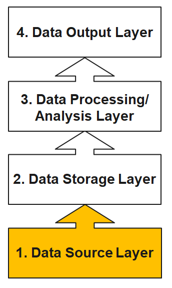
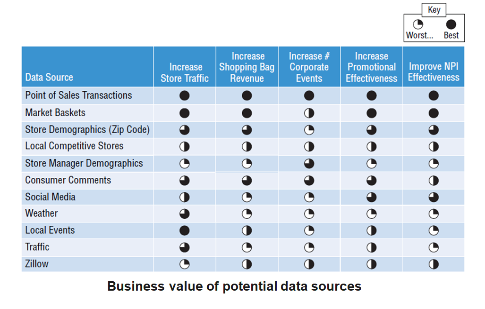
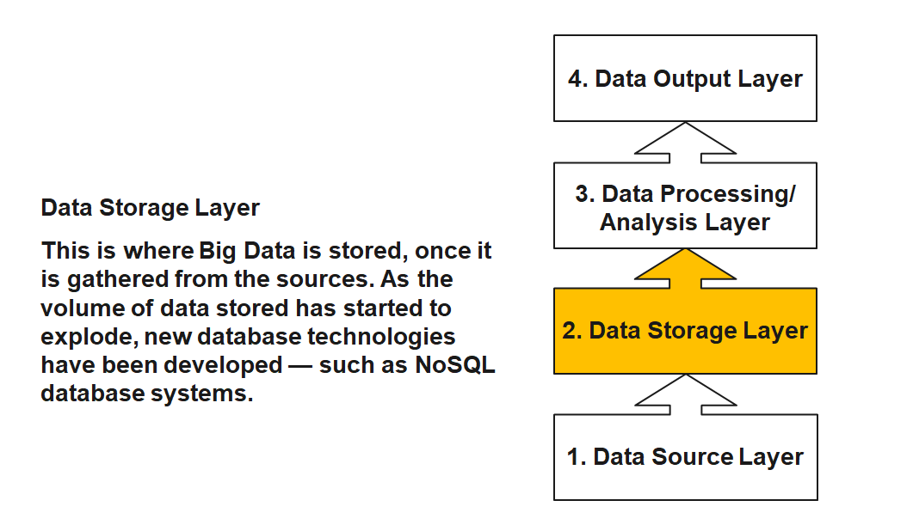
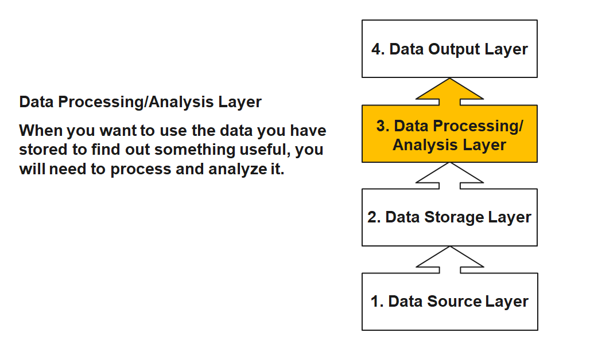
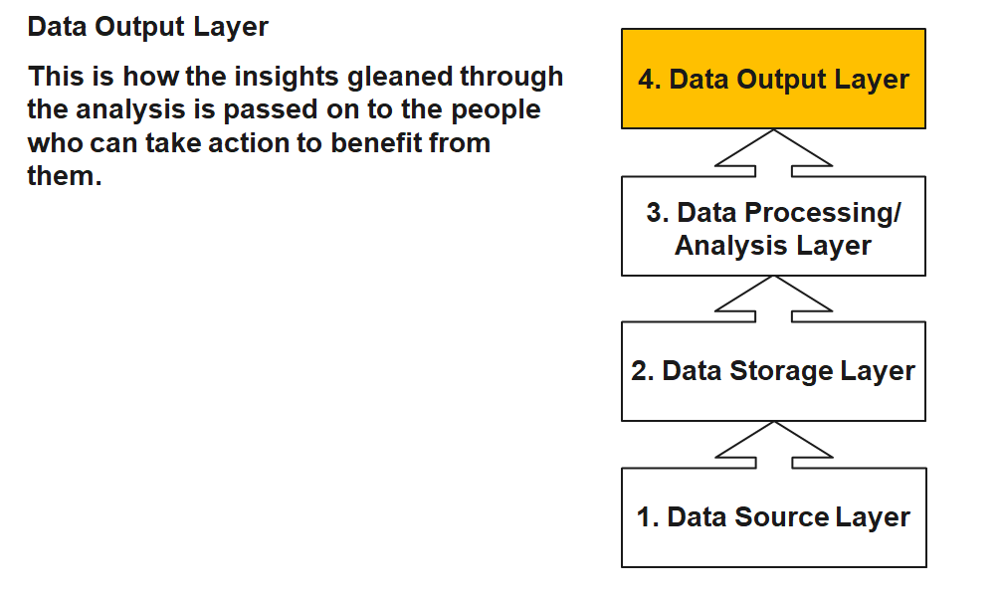
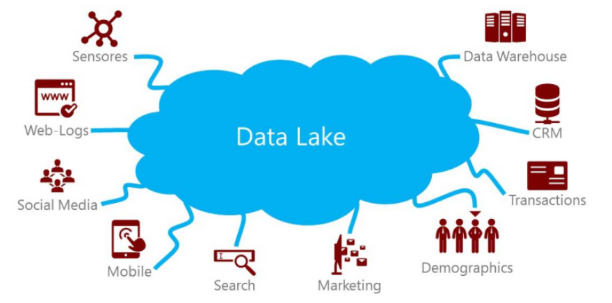
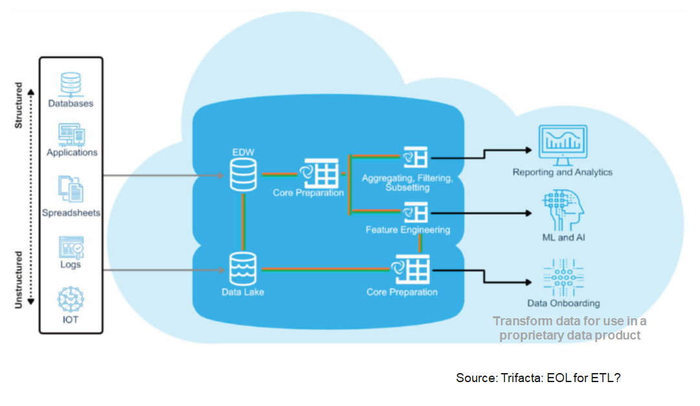
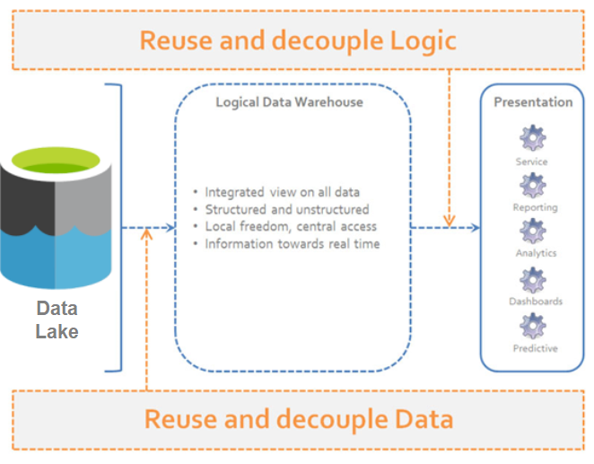

## {data-menu-title="Learning objectives" data-state="hide-menubar"}

<br><br><br><br><br>

::: {.learning-objectives}
- **Explain** how computing power, algorithms, and analytics processes enabled modern machine learning and AI for big data.
- **Compare** data warehouse, data lake, and logical data warehouse architectures.
- **Distinguish** descriptive, predictive, and prescriptive analytics.
- **Describe** the CRISP-DM analytics process.
- **Structure, clean, integrate, and transform** data for analysis.
- **Explain** tidy-data principles and select appropriate data types.
:::

## Why did machine learning for big data become powerful?

Modern machine learning and AI for big data became powerful through three mutually reinforcing developments:

1. **More computing power** made it possible to process large datasets and train more demanding models.
2. **New algorithms** enabled more powerful analytical models and new application areas.
3. **New analytics processes** made analytical work more mature, pervasive, and standardized.

# Computing power {data-stack-name="Computing power"}

## Growth of computing power

The rapid acceleration of computing power—driven by advances in hardware, cloud infrastructure, and parallel processing—has enabled modern analytics and machine learning to scale to massive datasets.

<!-- TODO : could include an illustration of a modern AI data center -->

<br>

{fig-align="center" width="70%"}

## Evolution of computing power

The growth of modern analytics is enabled by **changing strategies for increasing computing power**.

<br>

| Era | Main strategy | Explanation |
|-----|---------------|-------------|
| 1970s–2000s (*) | **Moore’s Law & miniaturization** | Smaller transistors → more components per chip → faster processors |
| 2005–today | **Parallel computing** | Performance increases by using multiple processors simultaneously |
| 2010s–today | **Specialized hardware** | Chips optimized for specific workloads (GPUs, TPUs, AI accelerators) |
| Emerging | **New computing paradigms** | Alternative computing models such as quantum computing |

::: aside
(*) Miniaturization continues today, but progress has slowed as transistors approach physical limits.
Advances such as extreme ultraviolet (EUV) lithography are required to continue scaling.
See how $400 million machines are constructed to build modern chips: [https://www.youtube.com/watch?v=MiUHjLxm3V0](https://www.youtube.com/watch?v=MiUHjLxm3V0).
:::

# Architecture {data-stack-name="Architecture"}

## TODO: revise the following

The "data warehouse" concept does not exist as a point of reference.

## Limitations of the data warehouse approach

Traditional DWH solutions are designed to provide a single point of truth. Important aspects are:

- Merge and unify data from multiple data sources
- High data quality
- Proper historization of the data
- Data Governance and Compliance

This results in the following problem areas in today's world:

- **Lack of flexibility** due to high effort for changes
- **Time expenditure** due to transfer from the operational sources and the aggregations
- **Past orientation** of data (snapshot of the past); there is an increasing need for ad hoc and real-time analyses
- **Partial knowledge**, as only structured data is stored, with increasing need for social media data, etc.
- **Patchwork**: due to gradual introduction of data warehouses, many isolated solutions exist and are operated separately both technically and methodologically


## The four layers of big data \(I\)

Data Source Layer

This is where the data arrives at the organization.
It includes everything from sales records, customer database, feedback, social media channels, marketing list, email archives etc.

{fig-align="center" width="300px"}

::: aside
— Source: http://de.slideshare.net/BernardMarr/140228-big-data-slide-share/3-The_basic_idea_behind_the
:::


## Identify and prioritize data sources

{fig-align="center" width="60%"}

::: aside
— Source: @Schmarzo2016, p. 49
:::


## The four layers of big data (II)

{fig-align="center" width="50%"}

::: aside
— Source: http://de.slideshare.net/BernardMarr/140228-big-data-slide-share/3-The_basic_idea_behind_the
:::


## The four layers of big data (III)

{fig-align="center" width="50%"}

::: aside
— Source: http://de.slideshare.net/BernardMarr/140228-big-data-slide-share/3-The_basic_idea_behind_the
:::


## The four layers of big data (IV)

{fig-align="center" width="50%"}

::: aside
— Source: http://de.slideshare.net/BernardMarr/140228-big-data-slide-share/3-The_basic_idea_behind_the
:::


## From data warehouse to data lake

Instead of recording millions of transactions, today's organizations are recording billions of interactions. Companies are capturing more and more data that can open business opportunities and unlock new sources of value for organizations.

Companies are not able to store this data in data warehouses because it is of high volume, mostly raw and often not structured. As consequence, data lakes have emerged as an alternative approach. The intent is to capture enterprise data and load it in its raw form into a centralized, large, and inexpensive storage system.

In shifting from data warehouses to data lakes, it became important to decouple data movement from data transformation. Data movement (the "E" and "L" of ETL) is an operational task. Data transformation (the "T" of ETL) is a content-based, analytic-facing task that requires an understanding both of the data and how it's to be used.

A clean separation between data movement and data transformation has the benefits of less friction because the instance loading the data isn't responsible for transforming it.

::: aside
— Source: Trifacta: EOL for
:::


## The data lake

A data lake is a method of storing data within a system in its natural format, that facilitates the collocation of data in various schemata and structural forms. The idea of data lake is to have a single store of all data in the enterprise ranging from raw data to transformed data which is used for various tasks including reporting, visualization, analytics and machine learning.

{fig-align="center" width="50%"}

::: aside
— Source: https://www.pmone.com/fileadmin/user_upload/pics/other/Data_lake.jpg
:::


## Modern data analytics architecture

{fig-align="center" width="70%"}


## Logical data warehouse

A "logical data warehouse" provides analytical company data without first physically moving it to a physical data warehouse.

As in a classic data warehouse, uniform views are provided for analysis purposes.

While the data in the classic data warehouse comes from a "well-defined" physically uniform database, the "logical data warehouse" pulls data together from the data lake at the time of the query.

Aggregation is done just in time. Thus, the schema of the data warehouse is just virtual.

{fig-align="center" width="40%"}

::: aside
— Source: http://www.datavirtualizationblog.com/emergence-logical-data-warehouse/
:::

# New algorithms {data-stack-name="Algorithms"}

## Algorithms

An algorithm is a step-by-step procedure for performing a computation and thereby solving a problem.

Algorithms determine which problems computers can solve and how efficiently they can solve them.

Examples:

- **Dijkstra’s Shortest-Path Algorithm** *(1959)* — Efficiently finding shortest paths through networks, foundational to routing, navigation, and network optimization
* **Evolutionary Algorithms** *(1960s)* — Population-based search and optimization methods inspired by evolution, used to find good solutions to complex problems where exact optimization is difficult
- **Scheduling Algorithms** *(1990s–present)* — Efficient process scheduling enabling operating systems to run tasks concurrently
- **PageRank** *(1998)* — Algorithm ranking webpages based on link structure, enabling scalable web search
- **Deep Learning** *(2010s)* — Improved neural network training enabling major advances in vision, speech, and language AI
- **Gradient Boosting** *(2014)* — High-performance ensemble learning algorithm widely used in predictive analytics and data science
- **Transformer Models** *(2017–present)* — Transformer architecture enabling large language models and generative AI

::: {.learning_note}

**Learning note**

No need to memorize all algorithms.<br>
Be able to give a few illustrative examples.<br>
This also applies to the data production areas.

:::

## Algorithms enable more powerful analytical models

<br><br>

::: columns
::: {.column width="30%"}
{width="90%"}

Traditional Regression

:::

::: {.column width="30%"}

{width="90%"}

Decision Tree
:::

::: {.column width="30%"}
{width="90%"}

Neural Network
:::

:::


## Algorithmic breakthroughs drive AI progress

Recent breakthroughs in artificial intelligence (AI)^[AI systems are based on algorithms; in the following, we use the broader term AI when referring to such algorithm-based systems.] show how new algorithms can rapidly surpass human performance.
**DeepMind** provides good examples.

::: columns

::: column

AlphaGo (2016)

- Uses **deep neural networks + reinforcement learning**
- Defeated world champion **Lee Sedol** in the game of Go

Go was long considered too complex for computers due to the enormous search space.

{width=50% fig-align="center"}

:::

::: column

AlphaFold (2020–2022)

- Uses deep learning to predict **protein structures**
- Achieved breakthrough performance in the **CASP competition**^[Hassabis and colleagues were awarded the 2024 Nobel Prize in Chemistry, in part for the development of AlphaFold.]

Predicting protein folding had been a major unsolved problem in biology for decades.

{width=50% fig-align="center"}

:::

:::


<!--
    ## AlphaGo

    > Go is one of the hardest games in the world for AI because of the huge number of different game scenarios and moves. The number of potential legal board positions is greater than the number of atoms in the universe.

    > The core of AlphaGo is a deep neural network. It was initially trained to learn playing by using a database of around 30 million recorded historical moves. After the training, the system was cloned and it was trained further playing large numbers of games against other instances of itself, using reinforcement learning to improve its play. During this training AlphaGo learned new strategies which were never played by humans.

    > A newer version named AlphaGo Zero skips the step of being trained and learns to play simply by playing games against itself, starting from completely random play.

    ::: {.notes}

    Chess 2^64 legal positions, Go 2^120!!!

    :::

    ## Libratus

    > An artificial intelligence called Libratus has beaten four of the world’s best poker players in a grueling 20-day tournament in January 2017.

    > Poker is more difficult because it’s a game with imperfect information. With chess and Go, each player can see the entire board, but with poker, players don’t get to see each other’s hands. Furthermore, the AI is required to bluff and correctly interpret misleading information in order to win.

    > “We didn’t tell Libratus how to play poker. We gave it the rules of poker and said ‘learn on your own’.” The AI started playing randomly but over the course of playing trillions of hands was able to refine its approach and arrive at a winning strategy.

-->

## Jagged frontier of AI

:::: {.columns}

::: {.column width="60%"}

<br><br>

```{python}
#| echo: false

import numpy as np
import matplotlib.pyplot as plt

# Categories (axes)
labels = [
    "Knowledge",
    "Reading & Writing",
    "Math",
    "Reasoning",
    "Working Memory",
    "Memory Storage",
    "Memory Retrieval",
    "Visual",
    "Auditory",
    "Speed"
]

# Example scores (approximate values from the illustration)
gpt4 = [8, 6, 4, 0, 2, 0, 4, 0, 0, 3]
gpt5 = [9, 10, 10, 7, 4, 0, 4, 4, 6, 3]

# Close the polygon
gpt4 = gpt4 + [gpt4[0]]
gpt5 = gpt5 + [gpt5[0]]

# Compute angles
angles = np.linspace(0, 2*np.pi, len(labels), endpoint=False).tolist()
angles += angles[:1]

# Create figure
# fig, ax = plt.subplots(figsize=(6,6), subplot_kw=dict(polar=True))
fig, ax = plt.subplots(figsize=(6,6), subplot_kw=dict(polar=True))

ax.set_theta_offset(np.pi / 2)   # rotate so first label is at top
ax.set_theta_direction(-1)       # make axes go clockwise

# Plot data
ax.plot(angles, gpt5, linewidth=2, label="GPT-5 (2025)")
ax.fill(angles, gpt5, alpha=0.15)

ax.plot(angles, gpt4, linewidth=2, label="GPT-4 (2023)")
ax.fill(angles, gpt4, alpha=0.15)

# Axis labels
ax.set_xticks(angles[:-1])
ax.set_xticklabels(labels)

# Radial limits
ax.set_ylim(0, 10)

# Grid and legend
ax.set_title("AI Capabilities", pad=20)
ax.legend(loc="upper right", bbox_to_anchor=(1.3, 1.1))

plt.show()
```
:::


::: {.column width="40%"}
<br><br>

::: {.highlight_must_learn}

AI progress often occurs through **algorithmic breakthroughs**, enabling machines to outperform humans in increasingly complex tasks.

Recent studies suggest that AI creates a **“jagged frontier.”** [@DellAcquaEtAl2023], i.e., some tasks are well suited to AI, while others that appear similar remain outside its capabilities.

- **Within this frontier, AI can strongly enhance knowledge work**, improving productivity and the quality of outputs.
- **Outside the frontier, AI can reduce performance**, especially when users rely too heavily on its outputs without verification.

:::

<!--
https://www.agidefinition.ai/
https://www.oneusefulthing.org/p/the-shape-of-ai-jaggedness-bottlenecks
https://www.youtube.com/watch?v=d95J8yzvjbQ
-->

:::

::::

::: aside
Figure based on the work of @HendrycksEtAl2025 on *Artificial General Intelligence*.
:::

# Analytics processes {data-stack-name="Analytics processes"}

## Maturing analytical capabilities


:::: {.columns}

::: {.column width="50%"}

::: {.highlight_must_learn}


**Descriptive analytics: What happened?**<br>

- Summarizes historical data to understand patterns and trends.<br>
- *Example: Sales reports, dashboards, KPIs*

**Predictive analytics: What will happen?**<br>

- Uses statistical models and machine learning to forecast future outcomes.<br>
- *Example: Demand forecasting, churn prediction*

**Prescriptive analytics: What should we do?**<br>

- Recommends actions based on predictions and optimization.<br>
- *Example: Pricing optimization, recommendation systems*

:::

:::


::: {.column width="50%"}

<br><br>
{width=100% fig-align=center}

:::

::::

<!--
      https://medium.com/aimonks/key-types-of-analytics-according-to-gartner-9dd5861debe2

      Types of Analytics (I)

      {fig-align="center" width="60%"}

      ::: aside
      Source: @Schmarzo2016, p. 88
      :::


    TODO: include explanation

      ## Explanation vs. Prediction (I)

      > Question 1: I have a headache. If I take an aspirin now, will it go away?

      > Question 2: I had a headache, but it passed. Was it because I took an aspirin two hours ago? Had I not taken such an aspirin, would I still have a headache?

      > The first case is a typical "predictive" question. You are calculating the effect of a hypothetical intervention.

      > The second case is a typical "explanatory" question. You are calculating the effect of a counterfactual intervention.

      ::: {.notes}

      Which one is Explanation, which Prediction?

      :::

      ## Explanation vs. Prediction (II)

      **Explanation:**

      - Explanation is about understanding relationships and why certain things happen.
      - It requires an understanding of cause and effect.
      - Tests of causal hypotheses are fundamental.
      - Measures of significance are central.
      - A good explanatory model may also have predictive power.

      **Prediction:**

      - Prediction is about anticipating and forecasting what may happen in the future.
      - Correlations are important in this context (but correlation does not imply causation).
      - Therefore, predictive models may have no real explanatory power.
      - For robust prediction, knowledge of causality is preferable.
      - The main task is to find a model that optimally approximates reality and minimizes overfitting.
      - Accuracy is measured using out-of-sample data.


-->

## Analytical purposes

<br><br>

<div class="smaller">

| What happened? (descriptive )    | What will happen? (predictive analytics) | What should I do? (prescriptive analytics) |
|----------------------------------|------------------------------------------|--------------------------------------------|
| How many widgets did I sell last month? | How many widgets will I sell next month? | Order **5,000** units of Component Z to support widget sales for next month. |
| What were sales by zip code for Christmas last year? | What will be sales by zip code over this Christmas season? | Hire **Y** new sales reps by these zip codes to handle projected Christmas sales. |
| How many of Product X were returned last month? | How many of Product X will be returned next month? | Set aside **$125K** in financial reserve to cover Product X returns. |
| What were company revenues and profits for the past quarter? | What are projected company revenues and profits for next quarter? | Sell the following product mix to achieve quarterly revenue and margin goals. |
| How many employees did I hire last year? | How many employees will I need to hire next year? | Increase hiring pipeline by **35%** to achieve hiring goals. |

</div>

<br><br>

 A particular method, such as regression or machine learning, can serve multiple purposes.

<!--
- What happened in the past?
- Find patterns and relationships in data and use them for prediction.
- Use the predictions to make decisions.
-->

::: aside
Source: @Schmarzo2016, p. 13
:::

## Example: Descriptive analytics

<br>

{fig-align="center" width="45%"}

## Example: Predictive analytics

<br>

{fig-align="center" width="60%"}

## Example: Prescriptive analytics

<!-- TODO: select an example that aligns more with prescriptive analytics (not scenario planning) -->

Based on more than 300 million data records per week, Otto generates over one billion forecasts annually on the expected sales of individual products in the coming days and weeks.
These forecasts are used to optimize inventory decisions, determining how many units of each product should be stocked or reordered across warehouses.
By systematically adjusting inventory levels based on these data-driven recommendations, Otto is able to reduce its overall inventories by up to 30% on average while maintaining product availability.

{fig-align="center" width="60%"}

::: aside
Source: http://www.bvl.de/misc/filePush.php?mimeType=application/pdf&fullPath=/files/441/442/777/1015/DLK12_C3-3_Praesentation_Stueben.pdf
:::

<!-- TODO: include an example from algorithmic management/Uber or automated financial trading -->

<!--
        ## Classical Corporate Planning

        {fig-align="center" width="60%"}

        ## Example Driver-based Planing (I)

        {fig-align="center" width="60%"}

        ## Example Driver-based Planing (II)

        {fig-align="center" width="40%"}

        1. Sales forecasts based on market and social media data
        2. Automated pricing based on market and competitor analyses
        3. Early detection of price changes and adjustment of purchasing behavior
        4. Optimization of inventory management based on customers' current purchasing preferences
-->

## Analytical models

There is a broad repertoire of models and methods from multiple disciplines, each with its own assumptions, data preparation steps, and modeling processes.
While these fields often focus on methodological development, business analytics emphasizes applying these approaches to support understanding and decision-making in organizational contexts.

<br>

| Discipline          | Model culture           | Typical models            |
| ------------------- | ----------------------- | ------------------------- |
| Statistics          | Probabilistic inference | Regression, GLM, Bayesian |
| Econometrics        | Causal modeling         | IV, panel models          |
| Computer Science    | Algorithmic learning    | Trees, SVM, NN            |
| Operations Research | Optimization            | Linear programming, Non-linear optimization                   |
| Management Science  | Decision modeling       | Stochastic optimization   |
| Complex Systems     | Simulation              | Agent-Based/Discrete Event Simulation                  |

<!--
    Oftentimes, the goal may also be to understand and explain, not to decide (prescribe).

    Statistics vs. Data Analytics

    
-->

## Cross-Industry Standard Process for Data Mining (CRISP-DM)

:::: {.columns}

::: {.column width="45%"}

::: {.highlight_must_learn}

**CRISP-DM** is a widely used framework that structures data mining and analytics projects [@WirthHipp2000].

- Developed by an **industry consortium** (e.g., DaimlerChrysler, SPSS, NCR) to create a common methodology for data mining projects.
- Designed to be **independent of specific industries and technologies**, making it applicable across many domains.
- Integrates **best practices from real-world projects**, helping teams plan, communicate, and document analytics work.
- Became popular because it provides a **reliable and repeatable standard process** for managing complex data mining projects.

:::

:::

::: {.column width="55%"}

<br>
```{dot}
//| fig-width: 8

digraph CRISPDM {
  layout=neato;
  overlap=false;
  splines=true;
  fontname="Helvetica";

  node [
    shape=box,
    style="rounded,filled",
    fillcolor="#f4f6fb",
    fontname="Helvetica",
    fontsize=20,
    width=2.8,
    height=1
  ];

  edge [
    penwidth=1.6,
    arrowsize=1.1
  ];

  // --- Circular positions ---
  A [label="Business\nUnderstanding", pos="-2,2!"];
  B [label="Data\nUnderstanding", pos="2,2!"];
  C [label="Data\nPreparation", pos="3,0!"];
  D [label="Modeling", pos="2,-2!"];
  E [label="Evaluation", pos="-2,-2!"];
  F [label="Deployment", pos="-4,0!", fillcolor="#e6f4ea"];

  // --- Central Database ---
  X [
    label="Data",
    shape=cylinder,
    fillcolor="#e9f2ff",
    fontsize=22,
    width=1.9,
    height=1.4,
    pos="0,0!"
  ];

  // --- Main Flow ---
  A -> B;
  B -> C;
  C -> D;
  D -> E;
  E -> F;

  // --- True Bidirectional Iterations ---
  B -> A;
  A -> B;

  D -> C;
  C -> D;

  E -> A;
  A -> E;
}
```

:::

::::

::: aside
Besides CRISP-DM, there are other models, such as KDD Process, SEMMA, or TDSP.
:::

## Foundations {data-state="hide-menubar"}

Before building analytical models, analysts typically engage in **data preparation and exploratory data analysis (EDA)**.

These activities are **closely intertwined and often iterative**:
we prepare and structure the data while simultaneously exploring it to understand its characteristics and potential issues.

Typical activities include:

* **Data preparation** (e.g., structuring, cleansing, integration)
* **Descriptive statistics** (e.g., mean, variance, frequencies)
* **Visualization techniques** (e.g., histograms, boxplots, scatterplots)

**Goal:**
develop an initial understanding of the data, detect patterns or anomalies, and ensure that the data is suitable for further analysis or modeling.


# Data preparation {data-stack-name="Data preparation"}

## Data types

Conducting EDA and representing the “real world” requires us to use appropriate data types.
Typically, we distinguish four fundamental data types, known as measurement scales:

Qualitative description of objects

- Nominal (special case: binary)
- Ordinal

Quantitative description objects

- Interval
- Ratio

## Qualitative: Nominal scale

- Values of a nominal (aka. categorical) attribute are symbols or names of things
- Each value represents some kind of category, code, or state.
- This scale assumes existence of a finite number of equivalency classes, where each class is named or labeled.
- The values do not have any meaningful order.

Examples:

- Hair color = {black, blond, brown, gray, red, white, …}
- Postal codes = {96047, 96048, …}

. . .

Special case of the nominal scale: Binary scale – also called Boolean

- Nominal attribute with only 2 states
- 0/FALSE typically means absence and 1/TRUE presence.

Examples:

- Smoking: 1 indicates patients in a trial that smoke, 0 otherwise.
- Purchase: 1 indicates that a person purchased a product, 0 otherwise.

## Qualitative: Ordinal scale^[Also known as a "rank scale".]

- A categorical attribute with values that have a meaningful order, but the magnitude between successive values is not known
- The ordinal scale is useful for registering subjective assessments and things that cannot be measured objectively (often used in surveys for ratings)

Values cannot be multiplied or added, even if the numbers belong to the same scale.

Relations between values:

- Transitivity: If A>B, B>C, then A>C,
- Symmetry: : If A>B, then B<A

Examples:

- School grades = {A < B < C < D < E < F} or {1 < 2 < 3 < 4 < 5 < 6}
- Places in a competition = {1st, 2nd, 3rd, 4th, …}

## Quantitative: Interval scale

- A numeric measurable attribute in the form of integer or real values.
  The distance between the numbers or units on this scale is equal over all levels of the scale.
  Values of the interval scale have no natural “zero” point.
- Invariant under a linear transformation 𝑎𝑥 + 𝑏, 𝑎 > 0, 𝑏 ≥ 0
- Although the sum of two interval-scale measurements is not meaningful by itself, their average can be computed

Examples:

- Celsius scale of temperature (there is no natural zero, 0°C is arbitrarily defined), a Celsius value 𝑐 can be linearly transformed to a Fahrenheit value 𝑓: 𝑓 = 9/5 ∗ 𝑐 + 32
- Dates and time (e.g., conversion from Julian to Gregorian calendar is possible)

## Quantitative: Ratio scale

- Numeric values with a meaningful zero point (e.g., “zero” means absence)
- All arithmetic rules and functions can be applied (addition, subtraction)

Examples:

- Money, person’s age, market share, quantities purchased, speed, …
- Kelvin (K) temperature (has a true zero-point (0 °K=− 273.15 ℃): It is the point at which the particles that comprise matter have zero kinetic energy

## Scales and mathematical operations

Due to the different mathematical properties, not all statistical measures can be computed on different measurement scales:

<br><br>

| Scale    | Mathematical operations possible                     | Mode | Frequency | Percentiles / Median | Mean / Variance / SD |
|----------|----------------------------------------------------|------|-----------|----------------------|----------------------|
| Nominal  | =, ≠                                               | X    | X         |                      |                      |
| Ordinal  | =, ≠, <, >                                         | X    | X         | X                    |                      |
| Interval | =, ≠, <, >, linear transformation                  | X    | (X)       | X                    | X                    |
| Ratio    | =, ≠, <, >, *, /, +, −                             | X    | (X)       | X                    | X                    |

<br>

<p style="font-size:0.8em; color:gray;">
\(X\) The frequency (relative / absolute) may be calculated for a numeric variable, but makes only sense when the number of possible values is low
</p>

::: {.learning_note .fragment}
**Learning focus**

No need to memorize the table.
Be able to **explain the scales and give examples of operations that are appropriate**.
:::

## Data quality and preparation

In business analytics, we rarely work with carefully curated datasets.
Instead, data often comes from **multiple systems, processes, and teams**, where it is primarily created for **operational purposes rather than analysis**.
Because these data sources are not always standardized or under the analyst’s control, quality issues are common:

- **Missing values** (e.g., incomplete historical market data)
- **Outdated values** (e.g., customer address has changed)
- **Inconsistent formats or units** (e.g., dates stored as text, mixed currencies)
- **Duplicate records** (e.g., customers with multiple accounts)
- **Measurement or data entry errors** (e.g., human data entry, broken sensors)

. . .

Before conducting analysis, we must ensure that the **data is fit for use** [@StrongLeeWang1997].

::: {.highlight_must_learn}

**Typical data preparation actions**

1. Data structuring
2. Data cleansing
3. Data integration
4. Data transformation

:::

. . .

 In many real-world analytics projects, **data preparation and cleaning can take up to ~80% of the total effort.**

## Data structuring: Example

There are many ways to structure the same dataset.
<br>

:::: {.columns}

::: {.column width="60%"}

**Option A (wide)**

<div class="smaller">

| Region | Year | Sales_Q1 | Sales_Q2 | Sales_Q3 | Sales_Q4 |
|------|------|------|------|------|------|
| Europe | 2023 | 120 | 140 | 160 | 150 |
| Asia | 2023 | 100 | 110 | 120 | 130 |

</div>

:::

::: {.column width="40%"}

**Option B (long)**

<div class="smaller">

| Region | Year | Quarter | Sales |
|------|------|------|------|
| Europe | 2023 | Q1 | 120 |
| Europe | 2023 | Q2 | 140 |
| Europe | 2023 | Q3 | 160 |
| Europe | 2023 | Q4 | 150 |
| Asia | 2023 | Q1 | 100 |
| Asia | 2023 | Q2 | 110 |
| Asia | 2023 | Q3 | 120 |
| Asia | 2023 | Q4 | 130 |

</div>

:::

::::

➡ **Which would you select as an input for a data analytics tool?**

. . .

<br>

→ Solution: **Option B**, because this is what **data analytics tools typically expect**.

## Data structuring: Principles

Data structure *typically* expected by data analytics tools

<br>

::: {.highlight_must_learn}

**Vocabulary**

- A **dataset** is a collection of **values** (e.g., nominal, categorical, numeric).
- Each value belongs to a **variable** and an **observation**

**Expected data structure**

- Each variable forms a column
- Each observation forms a row
- Each type of observational unit forms a table

:::

. . .

<br>

 Data must be structured according to the expectations of the analytical tool being used.
Reviewing the tool’s documentation and example datasets can help clarify the required format.

::: aside
Based on the Tidyverse and the work of @Wickham2014.
:::

## Data structuring: Example continued

**Dataset  `df` (wide)**

<div class="smaller">

| Region | Year | Sales_Q1 | Sales_Q2 | Sales_Q3 | Sales_Q4 |
|------|------|------|------|------|------|
| Europe | 2023 | 120 | 140 | 160 | 150 |
| Asia | 2023 | 100 | 110 | 120 | 130 |

</div>

Convert wide → long

```python
long_df = df.melt(
    id_vars=["Region", "Year"],
    var_name="Quarter",
    value_name="Sales"
)

long_df
```

. . .

Result:

<div class="smaller">

| Region | Year | Quarter  | Sales |
| ------ | ---- | -------- | ----- |
| Europe | 2023 | Sales_Q1 | 120   |
| Asia   | 2023 | Sales_Q1 | 100   |
| Europe | 2023 | Sales_Q2 | 140   |
| Asia   | 2023 | Sales_Q2 | 110   |
| ...    | ...  | ...      | ...   |

</div>

## Data structuring: Example continued

As a last step, we need to clean the `Quarter` column by removing the `"Sales_"` prefix:

```python
long_df["Quarter"] = long_df["Quarter"].str.replace("Sales_", "")
```

. . .

<br>

Final tidy dataset:

<div class="smaller">

| Region | Year | Quarter | Sales |
| ------ | ---- | ------- | ----- |
| Europe | 2023 | Q1      | 120   |
| Europe | 2023 | Q2      | 140   |
| Europe | 2023 | Q3      | 160   |
| Europe | 2023 | Q4      | 150   |
| Asia   | 2023 | Q1      | 100   |
| Asia   | 2023 | Q2      | 110   |
| Asia   | 2023 | Q3      | 120   |
| Asia   | 2023 | Q4      | 130   |

</div>

::: aside
Note: we will cover selected transformation operations like melt in the exercises.
:::

## Data cleansing

<br>

::: {.highlight_must_learn}

| Data issue                    | Example                                         | Data cleansing action                                                          |
| ----------------------------- | ----------------------------------------------- | ------------------------------------------------------------------------------ |
| Missing values                | Historical market data missing for some days    | Impute values (e.g., interpolate prices), fill with mean/median, or mark as NA |
| Outdated values               | Customer moved but old address still stored     | Update records from CRM, external address verification service                 |
| Outliers / implausible values | Age = 250, salary = −5000                       | Detect and remove, cap values, or replace with plausible values                |
| Inconsistent formats          | Dates stored as `"03/01/23"` and `"2023-01-03"` | Standardize to a single format (e.g., ISO date `YYYY-MM-DD`)                   |
| Inconsistent units            | Revenue in USD and EUR mixed in one column      | Convert to common currency                                                     |
| Duplicate records             | Same customer registered twice                  | Identify duplicates and merge records                                          |
| Data entry errors             | `"Munich"` vs `"Munch"`                         | Correct spelling using reference tables                                        |
| Sensor errors                 | Temperature sensor reports `9999`               | Remove invalid values or replace with interpolated measurements                |

:::

## Data integration

Organizations often store data in **different systems** (e.g., CRM, sales systems, web analytics).

:::: {.columns}

::: {.column width="50%"}

**Customer database (CRM)**

<div class="smaller">

| Customer_ID | Name | Country | Email |
|---|---|---|---|
| 101 | Alice | Germany | alice@example.com |
| 102 | Bob | France | bob@example.com |
| 103 | Clara | Germany | clara@example.com |

</div>

:::

::: {.column width="50%"}

**Sales transactions**

<div class="smaller">

| Customer_ID | Order_ID | Revenue |
|---|---|---|
| 101 | 5001 | 200 |
| 101 | 5002 | 150 |
| 103 | 5003 | 300 |

</div>

:::

::::

For analysis, we can **integrate these datasets** using the shared key `Customer_ID`.

```python
integrated_data = customers.merge(sales, on="Customer_ID")
```

. . .

This creates a combined dataset that links customer information with sales.

<div class="smaller">

| Customer_ID | Name  | Country | Email                                         | Order_ID | Revenue |
| ----------- | ----- | ------- | --------------------------------------------- | -------- | ------- |
| 101         | Alice | Germany | [alice@example.com](mailto:alice@example.com) | 5001     | 200     |
| 101         | Alice | Germany | [alice@example.com](mailto:alice@example.com) | 5002     | 150     |
| 103         | Clara | Germany | [clara@example.com](mailto:clara@example.com) | 5003     | 300     |

</div>

. . .

<br>

 For analytical purposes, **redundant values are often acceptable**.
  The goal is to organize data into a **tidy structure**, where **each row represents one observation** and all relevant variables are available for analysis.

::: aside
Note: We will cover data integration in more detail in the next lecture.
:::


## Data transformation: Example

::: columns

::: {.column width="50%"}

Often, the way data is **stored** determines which mathematical operations are possible.

**Example: timestamps stored as strings**

<div class="smaller">

| user_id | timestamp |
|---|---|
| 101 | "2025-03-12 14:23:05" |
| 102 | "2025-03-12 18:02:11" |
| 103 | "2025-03-13 09:15:42" |

</div>

If treated as a **string**, we can only perform operations such as:

- equality checks (`=` / `≠`)
- simple filtering or sorting

This **severely limits analysis**.

:::

::: {.column width="50%" .fragment}

**Format conversions** help transform raw data into representations suitable for EDA and analytical models:

<div class="smaller">

| Representation | Example | Possible analysis |
|---|---|---|
| Numeric timestamp | 1741789385 | time differences, time series |
| Hour of day | 14 | activity patterns during the day |
| Day of week | Wednesday | weekday vs. weekend behavior |
| Day of year | 71 | seasonal patterns |

</div>

:::

:::

. . .

<br>
 Data preparation transforms raw data into **formats that allow meaningful mathematical operations and analysis**.

## Summary {data-state="hide-menubar"}

- Modern machine learning and AI for big data were enabled by more computing power, new algorithms, and new analytics processes.
- Data warehouses, data lakes, and logical data warehouses provide different ways to make data available for analytics.
- Analytics capabilities have developed from descriptive toward predictive and prescriptive purposes.
- CRISP-DM structures analytics as an iterative process connecting business understanding, data, modeling, and evaluation.
- Data preparation structures, cleans, integrates, and transforms raw data into tidy analytical data.

# References {data-state="hide-menubar"}
