## {data-menu-title="Learning objectives" data-state="hide-menubar"}

<br><br><br><br><br>

::: {.learning-objectives}
- **Describe** variables, relationships between variables, and underlying structure in the data (e.g., clusters).
- **Explore** data sets using appropriate descriptive and visual techniques.
- **Explain** the role of exploratory data analysis in business decision-making.
:::

<!--
## Table of contents {data-state="hide-menubar"}
<ul class="menu"><ul>
-->

## Foundations

> People are not very good at looking at a column of numbers or a whole data table and then determining important characteristics of the data.
  EDA techniques have been devised as an aid in this situation.

<br>

The following forms of EDA are typically distinguished:

<br>

<table style="border-collapse:collapse; margin:auto; font-size:20px; text-align:center;">
  <tr>
    <td style="border:none; width:170px;"></td>
    <td style="border:none; padding:10px 24px; font-weight:600;">Univariate</td>
    <td style="border:none; padding:10px 24px; font-weight:600;">Multivariate</td>
  </tr>
  <tr>
    <td style="border:none; padding:18px 14px; font-weight:600; text-align:right;">Non-graphical</td>
    <td style="border:3px solid #444; padding:22px 28px; background:#f8f8f8;">
      mean, median<br>frequencies
    </td>
    <td style="border:3px solid #444; padding:22px 28px; background:#f8f8f8;">
      cross-tabs<br>correlations
    </td>
  </tr>
  <tr>
    <td style="border:none; padding:18px 14px; font-weight:600; text-align:right;">Graphical</td>
    <td style="border:3px solid #444; padding:22px 28px; background:#f8f8f8;">
      histograms<br>dot plots
    </td>
    <td style="border:3px solid #444; padding:22px 28px; background:#f8f8f8;">
      scatter plots<br>clustering
    </td>
  </tr>
</table>

# Univariate exploratory data analysis {data-stack-name="Univariate EDA"}

## Descriptive statistics

We use one real data set throughout the examples: 200 firms from four sectors.

```{r}
#| label: descriptive-statistics-load-packages
#| echo: true
#| message: false
#| warning: false

library(tidyverse)

firm_data_df <- read_csv(
  paste0(
    "https://raw.githubusercontent.com/fs-ise/",
    "machine-learning-for-big-data/main/",
    "exercises/data/firm_data.csv"
  ),
  show_col_types = FALSE
)

head(firm_data_df)
```

## Descriptive statistics by variable type

::: columns
::: {.column width="45%"}

**Categorical variables** (`sector`)

- frequency → number of observations per category

**Numerical variables** (`profit_margin`)

- mean → center
- variance / standard deviation → spread
- quantiles → position in the distribution
- compact overview of minimum, quartiles, median, mean, and maximum

:::

::: {.column width="55%"}

```{r}
#| label: descriptive-statistics-by-type
#| echo: true

table(firm_data_df$sector)

mean(firm_data_df$profit_margin)

var(firm_data_df$profit_margin)

sd(firm_data_df$profit_margin)

quantile(firm_data_df$profit_margin)

summary(firm_data_df$profit_margin)
```

:::
:::

## Histogram: shape, center, and spread

::: columns

::: {.column width="45%"}

- Numerical values are divided into intervals (**bins**).
- Bar height indicates how many observations fall into each interval.
- A histogram reveals the distribution's shape, center, spread, and unusual observations.

:::

::: {.column width="55%"}

```{r}
#| label: histogram-shape-center-and-spread-ggplot
#| echo: true
#| fig-width: 5
#| fig-height: 4
#| fig-align: center

ggplot(firm_data_df, aes(x = profit_margin)) +
  geom_histogram(bins = 20) +
  labs(
    x = "Profit margin",
    y = "Number of firms"
  )
```
:::

:::


::: aside
See [ggplot2 documentation](https://ggplot2.tidyverse.org/reference/ggplot.html) and [cheatsheet](https://rstudio.github.io/cheatsheets/html/data-visualization.html).
:::


<!--
## Mode and relative frequencies

::: columns

::: {.column width="50%"}

- A frequency table **counts** firms in each category.
- Relative frequencies express these counts as **proportions**.
- The category with the highest frequency is the **mode**: Healthcare.

:::

::: {.column width="50%"}

```{r}
#| label: mode-and-relative-frequencies-table
#| echo: true

table(firm_data_df$sector)

prop.table(
  table(firm_data_df$sector)
) |>
  round(2)
```
:::

:::
-->

## Boxplot

::: columns

::: {.column width="50%"}

- The boxplot is a condensed illustration of a distribution

- It consists of
  - Median (thick line)
  - 25% / 75% percentiles
  - “Whiskers”: the quartiles ± 1.5 × IQR
  - Outliers that are higher/lower than the whiskers

:::

::: {.column width="50%"}

```{r}
#| label: boxplot-ggplot
#| echo: true
#| fig-width: 4.5
#| fig-height: 3.2

ggplot(firm_data_df, aes(y = profit_margin)) +
  geom_boxplot() +
  labs(
    x = NULL,
    y = "Profit margin"
  )
```
:::

:::


## Boxplots can be used to compare different distributions

::: columns

::: {.column width="50%"}

The same summary can be calculated for each category.

**Observation:** Industry and Tech have wider interquartile ranges than Finance. Finance has the highest median profit margin and several potential outliers.

:::

::: {.column width="50%"}

```{r}
#| label: boxplots-can-be-used-to-compare-different-distributions-ggplot
#| echo: true
#| fig-width: 5
#| fig-height: 3.2

ggplot(
  firm_data_df,
  aes(x = sector, y = profit_margin)
) +
  geom_boxplot() +
  labs(
    x = "Sector",
    y = "Profit margin"
  )
```
:::

:::

# Multivariate exploratory data analysis {data-stack-name="Multivariate EDA"}

## Multivariate non-graphical EDA

Multivariate non-graphical EDA techniques generally show the relationship between two or more variables in the form of either cross-tabulation for categorical variables or correlation statistics for numerical variables.

<div style="display:flex;justify-content:center;margin-top:4em">
<div class="Multivariate-wrapper" >
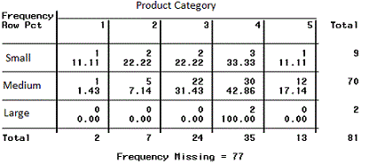
</div>
<div class="Multivariate-wrapper">
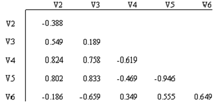
</div>
</div>

## Multivariate graphical EDA

When exploring multiple variables together, the appropriate visualization depends on the types of variables being compared.

::: columns

::: {.column width="45%"}
**Scatterplot**

```{r}
#| label: multivariate-graphical-eda-ggplot
#| echo: true
#| fig-width: 5
#| fig-height: 2.5
#| fig-align: center

ggplot(firm_data_df) +
  geom_point(
    aes(
      x = rd_intensity,
      y = profit_margin
    )
  )
```

:::

::: {.column width="50%"}
**Line plot**

```{r}
#| label: multivariate-eda-line-plot
#| echo: true
#| fig-width: 5
#| fig-height: 2.5
#| fig-align: center

ggplot(economics) +
  geom_line(aes(x = date, y = unemploy))
```

:::

:::

<!--
`geom_point()` shows relationships between numerical variables.
`geom_line()` connects observations along an ordered x-axis.
-->

## Bivariate statistics: Correlation

<!--
So far, we focused on the description of one variable (univariate statistics).
But in many cases, we are interested in the interactions between variables.
-->

**Correlation** measures how strongly two variables move together.
Suppose we observe two variables for the same observations:

$$X = (x_1, x_2, ..., x_n)$$

$$Y = (y_1, y_2, ..., y_n)$$

The **Pearson correlation coefficient** is calculated as:

$$r =
\frac{\sum_{i=1}^{n}(x_i-\bar{x})(y_i-\bar{y})}
{\sqrt{\sum_{i=1}^{n}(x_i-\bar{x})^2}\sqrt{\sum_{i=1}^{n}(y_i-\bar{y})^2}}$$


::: columns

::: {.column width="50%"}

```{python}
#| label: correlation-scatterplot
import numpy as np
import matplotlib.pyplot as plt

np.random.seed(1)
x = np.random.normal(size=100)
y = np.random.normal(size=100)

plt.figure(figsize=(7,4))
plt.scatter(x, y, color="#002EFF", s=40, alpha=0.8)
plt.title("Low correlation (r ≈ 0)")
plt.xlabel("X")
plt.ylabel("Y")
plt.show()
```

:::

::: {.column width="50%"}

```{python}
#| label: correlation-coefficient-scale
#| fig-width: 4
#| fig-height: 1

import numpy as np
import matplotlib.pyplot as plt

np.random.seed(1)
x = np.random.normal(size=100)
y = 0.8*x + np.random.normal(scale=0.3, size=100)

plt.figure(figsize=(7,4))
plt.scatter(x, y, color="#002EFF", s=40, alpha=0.8)
plt.title("High correlation (r ≈ 0.8)")
plt.xlabel("X")
plt.ylabel("Y")
plt.show()
```

:::

:::


## Correlation vs. causality


**Correlation:** Two data series behave "similar"

**Causality:** Principle of cause and effect

. . .

<br>

::: columns

::: {.column width="50%"}
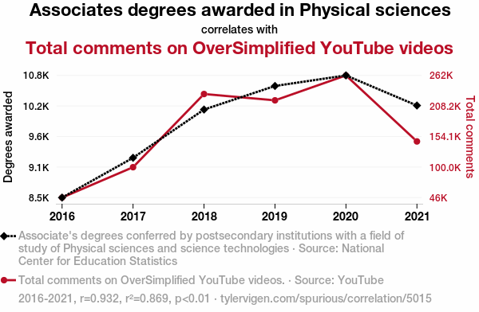{width=60% fig-align="center" }
:::

<!-- TODO: replace the second example with firefighter / damages?  -->

::: {.column width="50%"}
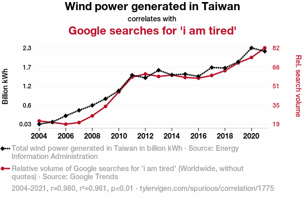{width=60% fig-align="center" }
:::

:::

. . .

 Correlation does not imply causation.

. . .

 Bivariate correlations are often insufficient for prediction or explanation, requiring more powerful analytical models.

. . .

  If causal explanations are unavailable, decisions may need to rely on predictions.

::: aside
More examples are available at: <https://www.tylervigen.com/spurious-correlations>
<!-- Note: CC-BY licensed  -->
:::

## Clustering in EDA

In **multivariate exploratory data analysis**, we often want to understand whether **observations form natural groups**.

**Clustering** is an EDA technique that groups **similar observations** based on their characteristics.

<br>
Common use cases include:

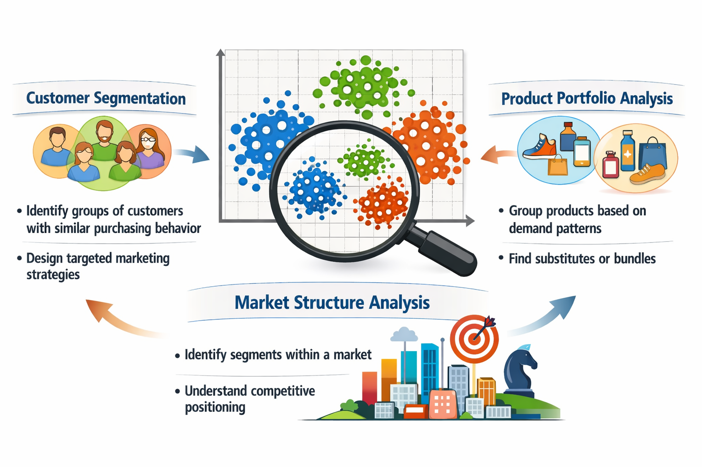{width=50% fig-align=center}

::: {.notes}
Timing: ~4 minutes.

Emphasize: clustering is usually **not the final model**.
It is used to **understand structure in the data**.

Typical workflow:

EDA → clustering → interpretation → downstream analytics.
:::

## Families of clustering methods

Clustering algorithms can be grouped into several **families of approaches**.

<br>

<div class="smaller">

| Family | Examples | Key characteristics |
|------|------|------|
| **Partitioning methods** | **k-means**, k-medoids (PAM), bisecting k-means | divide observations into a predefined number k of clusters; k-means is computationally efficient and widely used for **business/customer segmentation** |
| **Hierarchical methods** | **Agglomerative clustering**, divisive clustering | clusters formed through **successive merging or splitting**; produce **dendrograms (cluster trees)**; useful for **exploratory structure discovery** |
| **Density-based methods** | DBSCAN, HDBSCAN | clusters defined as **regions of high density**; identify **arbitrary shapes** and **outliers/noise** |
| **Probabilistic / model-based methods** | Gaussian mixture models | clusters modeled as **probability distributions**; allow **soft cluster membership** when groups overlap |

</div>
. . .

In this lecture we focus on **k-means** (segmentation) and **agglomerative hierarchical clustering**.

::: {.notes}
Timing: ~5 minutes.

Goal: give students a quick mental map of clustering methods.

Emphasize that many algorithms exist, but we focus on the two most intuitive and widely taught ones:

- k-means
- agglomerative hierarchical clustering.
:::

## Segmentation clustering

Segmentation methods divide observations into **k clusters**.

Goal:

* maximize similarity **within clusters**
* maximize differences **between clusters**

The most widely used algorithm:

**k-means clustering**

Key assumption:

clusters are roughly **spherical and similar in size**.

::: {.notes}
Timing: ~2 minutes.

Explain the intuition first before showing the algorithm.
:::

<!--
      ## Partitioning cluster methods

      Given a set of observations $(x_1, x_2, \ldots, x_n)$, where each observation is a $m$-dimensional real vector, k-means clustering aims to partition the $n$ observations into $k \leq n$ segments $S = \{S_1, S_2, \ldots, S_k\}$ so as to minimize the within-cluster sum of squares (WCSS).

      The objective is to find where  is the mean of points in Si.

-->

## k-means: The algorithm

For a given **k**, the algorithm finds cluster centers that minimize **within-cluster sum of squares**.

::: {.highlight_must_learn}
Steps:

```r
Randomly assign data points to k clusters

Repeat:

    calculate centroids for each cluster

    for each data point:
        compute distance to all centroids

        if x is not closest to its current centroid:
            assign x to the nearest centroid

    if centroids and cluster assignments no longer change:
        stop
```
:::

. . .

<br>

Strengths: fast and scalable, easy to interpret

Limitations: must choose **k**, sensitive to scaling and outliers.

::: {.notes}
Timing: ~4 minutes.
:::

## k-means: Comparison of solutions for different k

```{python}
#| label: k-means-how-cluster-solutions-evolve-import-numpy-as-np

import numpy as np
import matplotlib.pyplot as plt
from sklearn.datasets import make_blobs
from sklearn.cluster import KMeans
import ipywidgets as widgets

# generate synthetic data
X, _ = make_blobs(n_samples=300, centers=4, cluster_std=1.2, random_state=42)

def plot_k(k):
    import matplotlib.pyplot as plt
    from sklearn.cluster import KMeans

    kmeans = KMeans(n_clusters=k, random_state=42)
    labels = kmeans.fit_predict(X)

    plt.figure(figsize=(3.6, 2.8))
    plt.scatter(X[:, 0], X[:, 1], c=labels, s=10)
    plt.scatter(
        kmeans.cluster_centers_[:, 0],
        kmeans.cluster_centers_[:, 1],
        c='red', marker='x', s=60, linewidth=2
    )
    plt.title(f"k={k}", fontsize=10)
    plt.xticks([])
    plt.yticks([])
    plt.tight_layout()
    plt.show()
```

<br>

:::: {layout="[25,25,25,25]"}

::: {.fragment}
```{python}
#| label: k-means-how-cluster-solutions-evolve-plot-1
plot_k(1)
```
:::

::: {.fragment}
```{python}
#| label: k-means-how-cluster-solutions-evolve-plot-2
plot_k(2)
```
:::

::: {.fragment}
```{python}
#| label: k-means-how-cluster-solutions-evolve-plot-3
plot_k(3)
```
:::

::: {.fragment}
```{python}
#| label: k-means-how-cluster-solutions-evolve-plot-4
plot_k(4)
```
:::

::: {.fragment}
```{python}
#| label: k-means-how-cluster-solutions-evolve-plot-5
plot_k(5)
```
:::

::: {.fragment}
```{python}
#| label: k-means-how-cluster-solutions-evolve-plot-6
plot_k(6)
```
:::

::: {.fragment}
```{python}
#| label: k-means-how-cluster-solutions-evolve-plot-7
plot_k(7)
```
:::

::: {.fragment}
<br><br><br>
**…**

:::

::::

::: aside
**Note:** The plots show the final result after the algorithm has converged, i.e., once observation assignments and cluster centroids no longer change.
:::

## k-means: Implementation in R

```{r}
#| label: k-means-implementation-in-r-set-seed
#| echo: true
#| fig-width: 5
#| fig-height: 3.8
#| fig-align: center

set.seed(42)       # for reproducibility

X <- firm_data_df |>
  select(profit_margin, rd_intensity) |>
  scale()

km <- kmeans(X, centers = 4, nstart = 25)

as.data.frame(X) |>
  mutate(cluster = factor(km$cluster)) |>
  ggplot(aes(x = profit_margin, y = rd_intensity, color = cluster)) +
    geom_point() + labs(color = "Cluster")
```

<!--
```r
fit <- kmeans(X, centers = k, nstart = 25)
labels <- fit$cluster
```
. . .

  `kmeans(X, centers = k)` runs the iterative algorithm we saw earlier:

- initialize centroids, assign points to the nearest centroid, update centroids (repeat until convergence)

The fitted object contains a vector of cluster labels (one for each observation).
. . .

 Input data `X` must have a specific structure, as discussed in data preparation:

- rows = observations (data points)
- columns = features (dimensions)

**Example:**

```r
X <- matrix(c(
  1.2, 3.4,
  1.0, 3.0,
  5.5, 8.1
), ncol = 2, byrow = TRUE)
```
-->

## k-means: Choosing the number of clusters (I)

A common heuristic is the **elbow method**.

**Idea:**

- increase k
- measure improvement in model fit
- look for point where improvement slows

. . .

**Example metric:** within-cluster variance (inertia)

```{r}
#| label: k-means-choosing-the-number-of-clusters-i-elbow
#| echo: false
#| fig-width: 7
#| fig-height: 3
#| fig-align: center

elbow <- map_dfr(1:9, \(k) {
  set.seed(42)

  km <- kmeans(
    X,
    centers = k,
    nstart = 25
  )

  tibble(
    k = k,
    withinss = km$tot.withinss
  )
})

ggplot(elbow, aes(k, withinss)) +
  geom_line() +
  geom_point() +
  labs(
    x = "Number of clusters (k)",
    y = "Within-cluster sum of squares"
  )

```

<!--
```{python}
#| label: k-means-choosing-the-number-of-clusters-i-from-sklearn-cluster-import
#| fig-align: center
#| message: false
#| warning: false
#| out-width: 70%

from sklearn.cluster import KMeans

ks = range(1,10)
inertia = []

for k in ks:
    model = KMeans(n_clusters=k, random_state=42)
    model.fit(X)
    inertia.append(model.inertia_)

plt.figure(figsize=(5,3))
plt.plot(ks, inertia, marker="o")
plt.xlabel("k")
plt.ylabel("Within-cluster variance")
plt.title("Elbow method")
plt.show()
```
-->
. . .

Choose k at the **“elbow”** (diminishing returns)

::: {.notes}
Timing: ~3 minutes.

Key point: inertia always decreases → we look for where gains flatten out.

Emphasize: heuristic, not a strict rule.
:::

## k-means: Choosing the number of clusters (II)

An alternative is the **silhouette score**.

**Idea:**

- evaluate cohesion (within clusters)
- evaluate separation (between clusters)
- combine both into a single score

. . .

Choose k that **maximizes the score**

```{r}
#| label: k-means-choosing-the-number-of-clusters-ii-silhouette-scores
#| echo: false
#| fig-width: 7
#| fig-height: 3
#| fig-align: center

silhouette_scores <- map_dfr(2:9, \(k) {
  set.seed(42)

  km <- kmeans(
    X,
    centers = k,
    nstart = 25
  )

  s <- cluster::silhouette(
    km$cluster,
    dist(X)
  )

  tibble(
    k = k,
    silhouette = mean(s[, "sil_width"])
  )
})

ggplot(
  silhouette_scores,
  aes(k, silhouette)
) +
  geom_line() +
  geom_point() +
  labs(
    x = "Number of clusters (k)",
    y = "Average silhouette score"
  )
```

<!--
```{python}
#| label: k-means-choosing-the-number-of-clusters-ii-from-sklearn-metrics-import
#| fig-align: center
#| out-width: 70%

from sklearn.metrics import silhouette_score

ks = range(2,10)
scores = []

for k in ks:
    model = KMeans(n_clusters=k, random_state=42)
    labels = model.fit_predict(X)
    scores.append(silhouette_score(X, labels))

plt.figure(figsize=(5,3))
plt.plot(ks, scores, marker="o")
plt.xlabel("k")
plt.ylabel("Silhouette score")
plt.title("Silhouette analysis")
plt.show()
```
-->

. . .

Higher = better separation and compactness

::: {.notes}
Contrast with elbow:

- elbow → diminishing returns
- silhouette → clear maximum

Highlight: combines two criteria (cohesion + separation).
:::

## Hierarchical clustering

Hierarchical clustering builds a **tree of clusters**.

There are two types of hierarchical cluster methods:

- **Agglomerative hierarchical clustering** is a bottom-up clustering method. It starts with every single data object in a single cluster.
  Then, in each iteration, it agglomerates (merges) the closest pair of clusters by satisfying some similarity criteria, until all the data is in one cluster.
- **Divisive hierarchical clustering** is a top-down clustering method.
  It works similarly to agglomerative clustering but in the opposite direction.
  This method starts with a single cluster containing all data objects, and then successively splits resulting clusters until only clusters of individual data objects remain.

<!-- https://www.bioinformaticscrashcourse.com/9.1_Clustering.html -->

## Dendrogram

A dendrogram is a tree diagram frequently used to illustrate the arrangement of the clusters produced by hierarchical clustering.
The y-axis represents the value of this distance metric (e.g. Euclidean distance) between the clusters.

In a dendrogram the widths of the horizontal lines give an impression about the dissimilarity of the merging object.
Thus, a good cluster number might be at a point from where the width of the following horizontal lines is significantly shorter.

This allows us to explore clusters at **multiple levels of granularity**.

```{python}
#| label: dendrogram-from-scipy-cluster-hierarchy-i
#| echo: false
#| fig-align: center
#| out-width: 50%

from scipy.cluster.hierarchy import dendrogram, linkage

Z = linkage(X, method='ward')

_ = plt.figure(figsize=(6,4))
_ = dendrogram(Z)
_ = plt.title("Dendrogram")
_ = plt.xlabel("Observations")
_ = plt.ylabel("Distance")
_ = plt.show()
```

<!--
## Measuring similarity between clusters

When merging clusters, we must define **distance between clusters**.

Common linkage choices:

* **single linkage**

  * nearest neighbor distance

* **complete linkage**

  * farthest neighbor distance

* **average linkage**

  * average pairwise distance

* **Ward linkage**

  * merges clusters minimizing variance increase.

::: {.notes}
Timing: ~3 minutes.

Ward is often used with Euclidean distance.
:::


      ## Measuring similarity between clusters (I)

      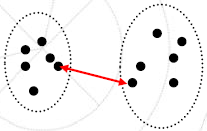

      > Distance between two clusters is the distance between the closest points:

      > **Complete Linkage:**

      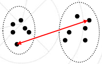

      > Distance between two clusters is the distance between the farthest pair of points:

      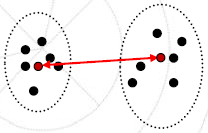

      > Distance between two clusters i and j is the distance between their centroids:


      ## Measuring similarity between clusters (II)

      > **Average Linkage:**

      > Distance between clusters is the average distance between the cluster points:

      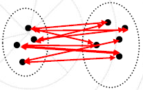

      > **Ward’s Method / Minimum Variance Method (only Agglomerative):**

      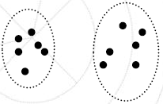

      > Ward's minimum variance criterion minimizes the total within-cluster variance. At each step the pair of clusters is merged that leads to minimum increase in total within-cluster variance after merging. This can be calculated as the square of the distance between cluster means divided by the sum of the reciprocals of the number of observations in each cluster:

      > For a comparison of the methods see: Ferreira, L.; Hitchcock, D. B. (2009): A Comparison of Hierarchical Methods for Clustering Functional Data, http://people.stat.sc.edu/Hitchcock/compare_hier_fda.pdf


      ## Single linkage example (I)

      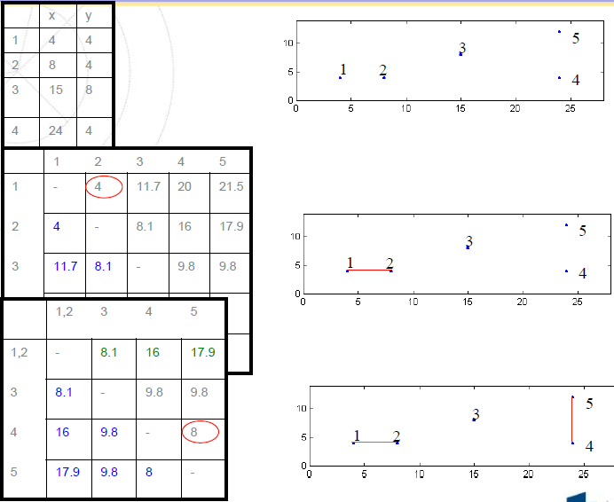

      ::: aside
      — Source: Fred, Ana: Unsupervised Learning, Universidade Técnica de Lisboa
      :::

      ## Single linkage example (II)

      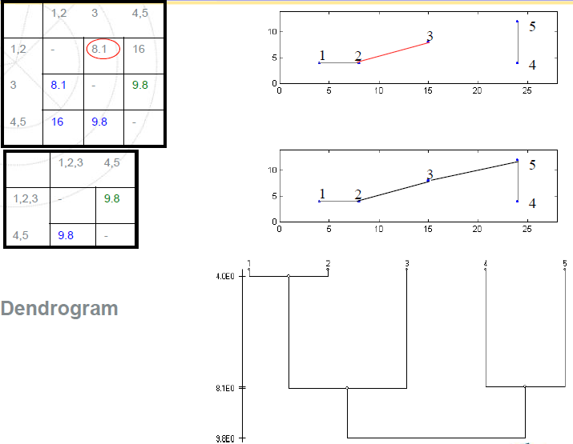

      ::: aside
      — Source: Fred, Ana: Unsupervised Learning, Universidade Técnica de Lisboa
      :::
-->

## Evaluation of clusters

⚠ Clustering algorithms will **always produce groups**, even when no meaningful structure exists.

Therefore, clusters must be **evaluated**.

Common evaluation approaches include:

* **internal validation**

  * silhouette score
  * cluster stability

* **external validation**

  * compare with known labels or metadata

* **interpretability checks**

  * do cluster profiles make sense in the given context?

::: aside
Based on @BalijepallyMangalarajIyengar2011.
:::

::: {.notes}
Timing: ~3 minutes.

Key warning:

Clusters ≠ truth.
They are hypotheses about structure in the data.
:::

## Why clustering is useful in analytics workflows

Clustering often supports **later analytical steps**.

For example:

* **Customer segments in data warehouses**

  * segments stored as features for reporting or dashboards

* **Heterogeneity in regression models**

  * different segments may follow different behavioral patterns
  * subgroup analysis or separate models

* **Machine learning pipelines**

  * clustering can generate **features** or **latent groups**

* **Hypothesis generation and model development**

  * clusters can reveal **previously unnoticed patterns or structures**
  * these patterns may suggest **new hypotheses** about behavior or relationships in the data
  * clustering can therefore **inform model specification**, variable selection, or interaction terms

::: {.notes}
Timing: ~3 minutes.

Key message:
Clustering often produces **insights that guide later modeling**.
:::

## Summary {data-state="hide-menubar"}

**Exploratory Data Analysis (EDA)** helps us understand data **before modeling**.

**Key steps:**

- **Describe variables**
  - univariate statistics (mean, variance, distributions)
  - visualization (histograms, boxplots)

- **Analyze relationships**
  - multivariate patterns (correlation, scatterplots)
  - ⚠ correlation ≠ causation

- **Identify structure**
  - segmentation (elbow method/silhouette score)
  - hierarchical clustering (dendrogram)

   EDA is **not the final analysis**, but a **foundation** for model building, decision-making, and hypothesis generation.



# References {data-state="hide-menubar"}
