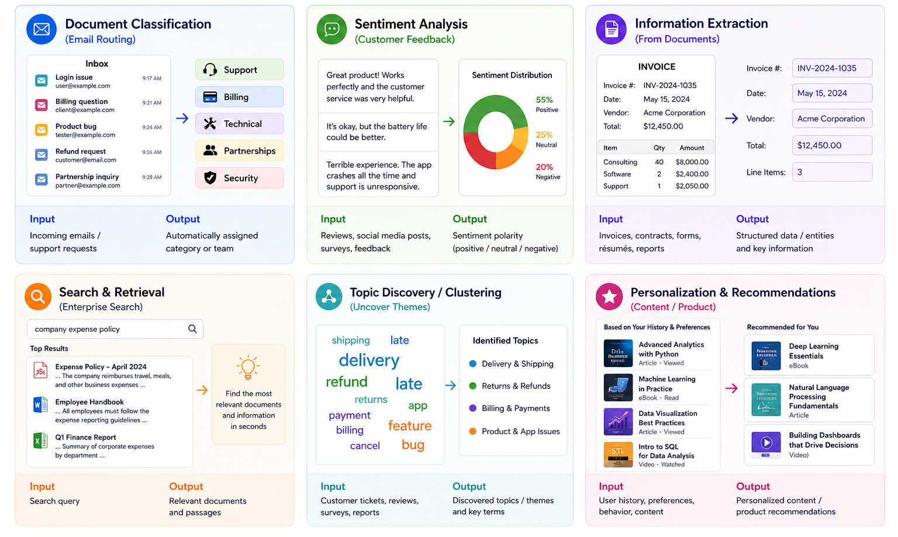
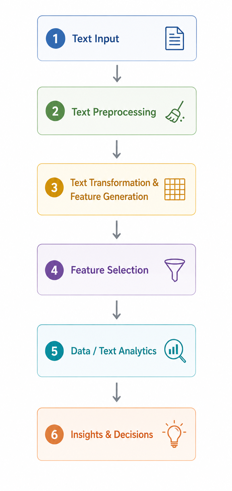
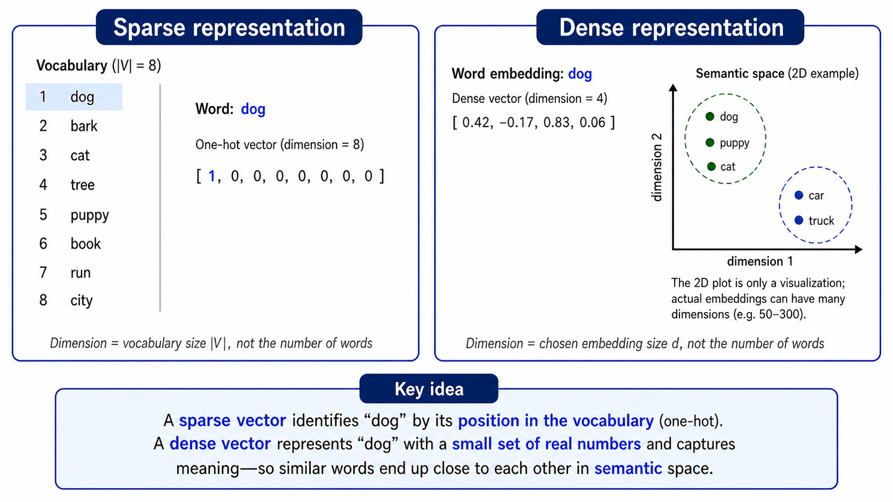
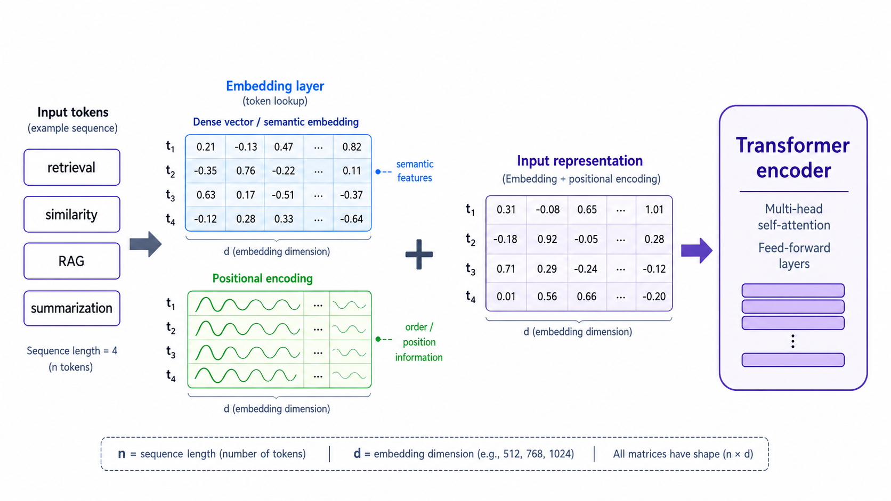

## {data-menu-title="Learning objectives" data-state="hide-menubar"}

<br><br><br><br><br>

::: {.learning-objectives}
- **Describe** the text analytics pipeline from preprocessing to representation and modeling.
:::

# Text analytics {data-stack-name="Text analytics"}

## Text analytics

:::: {.columns}

::: {.column width="50%"}

The vast majority of global data is stored in unstructured formats.
For example:

- emails and internal communication
- customer support tickets
- meeting notes and reports
- product reviews and social media posts
- annual reports and corporate filings
- contracts and legal documents
- job descriptions and résumés
- scientific and market research reports
- CRM notes and sales reports
- helpdesk and incident reports

:::

::: {.column width="50%"}
**Text analytics** combines methods from natural language processing, machine learning, information retrieval, and statistics to systematically analyze large volumes of textual data and derive actionable insights.

{width=70%}

:::

::::

::: aside
*Text mining* is often viewed as a subset of the broader field of text analytics, emphasizing the discovery of previously unknown patterns in textual data.
Here, we use the broader term *text analytics*.
:::

## Application areas

{fig-align=center width=75%}

## Text preprocessing

:::: {.columns}

::: {.column width="80%"}
Typical sources of **noise**

- punctuation, HTML tags, URLs, emojis
- inconsistent casing and formatting
- very frequent but low-information words (**stopwords**)
- morphological variants (*user*, *users*, *using*)

Preprocessing options *(choose what fits the analytical approach)*

1. **Text cleanup**
   remove punctuation / HTML / special characters
2. **Tokenization**
   split text into words or *n*-grams
3. **Stopword removal**
   remove frequent low-information words
4. **Stemming / lemmatization**
   reduce related word forms to a common base
5. **Advanced linguistic processing**
   POS tagging, parsing, word sense disambiguation, synonym / pronoun normalization

:::

::: {.column width="20%"}

<div style="position: relative; width: 100%;">



<!-- subtle highlight -->

<div style="
position: absolute;
left: 12%;
top: 15.5%;
width: 73%;
height: 13.5%;
border: 3px solid #5aa469;
border-radius: 18px;
background: rgba(90,164,105,0.05);
box-shadow: 0 0 10px rgba(90,164,105,0.12);
">
</div>

<!-- arrow -->

<div style="
position:absolute;
left: 2%;
top: 16.5%;
font-size: 1.5em;
color:#5aa469;
font-weight:bold;
line-height:1;
">
➜
</div>

</div>

:::

::::

<!--


-->


## Text processing: Examples

:::: {.columns}

::: {.column width="80%"}

Stopword removal:

```{r}
#| echo: true
library(quanteda)
documents <- "Jupiter is the largest gas planet."
tokens(documents,remove_punct=TRUE) |>
  tokens_remove(stopwords("en")) |>
  dfm() |>
  featnames()
```

<!--
Stemming:

```r
library(quanteda)
tokens <- tokens("Jupiter is the largest gas planet",remove_punct=TRUE)
tokens_wordstem(tokens,language="english")
```
-->


:::

::: {.column width="20%"}

<div style="position: relative; width: 100%;">


<!-- subtle highlight -->

<div style="
position: absolute;
left: 12%;
top: 15.5%;
width: 73%;
height: 13.5%;
border: 3px solid #5aa469;
border-radius: 18px;
background: rgba(90,164,105,0.05);
box-shadow: 0 0 10px rgba(90,164,105,0.12);
">
</div>

<!-- arrow -->

<div style="
position:absolute;
left: 2%;
top: 16.5%;
font-size: 1.5em;
color:#5aa469;
font-weight:bold;
line-height:1;
">
➜
</div>

</div>

:::

::::

## Feature generation: Sparse representations (classical NLP)

:::: {.columns}

::: {.column width="80%"}

A document is treated as a **bag of words** or terms.

- each word or term becomes a **feature**
- word order is ignored
- each document is represented as a **vector**
- the result is a structured **document-term matrix**

**Key idea**: Text is transformed into numerical features that can be used by classical machine learning models.

<br>
**Ways to create vectors**

<div class="smaller">
| Technique | Feature value |
|---|---|
| **Binary term occurrence** | term appears: yes / no |
| **Term occurrence** | number of times a term appears |
| **Term frequency** | occurrences divided by document length |
| **TF-IDF** | frequency weighted by how distinctive the term is |
</div>

:::

::: {.column width="20%"}

<div style="position: relative; width: 100%;">


<!-- subtle highlight -->

<div style="
position: absolute;
left: 12%;
top: 30.5%;
width: 73%;
height: 14.5%;
border: 3px solid #5aa469;
border-radius: 18px;
background: rgba(90,164,105,0.05);
box-shadow: 0 0 10px rgba(90,164,105,0.12);
">
</div>

<!-- arrow -->

<div style="
position:absolute;
left: 2%;
top: 32.5%;
font-size: 1.5em;
color:#5aa469;
font-weight:bold;
line-height:1;
">
➜
</div>

</div>

:::

::::


## Feature generation: TF-IDF example

:::: {.columns}

::: {.column width="80%"}

TF-IDF (term frequency-inverse document frequency) measures how important a term is to a document relative to a corpus

  - $tf$ (term frequency): how often a term appears in a document
  - $idf$ (inverse document frequency): how rare a term is across the corpus

  $$idf_i = log(\frac{N}{df_i})$$

with $N$: total number of documents
$df_i$: the number of documents in which $t_i$ appears.

TF-IDF weight:

$$w_{ij} = tf_{ij} \times idf_i$$

- Gives more weight to rare words
- Gives less weight to common words (domain-specific stopwords)

:::

::: {.column width="20%"}

<div style="position: relative; width: 100%;">


<!-- subtle highlight -->

<div style="
position: absolute;
left: 12%;
top: 30.5%;
width: 73%;
height: 14.5%;
border: 3px solid #5aa469;
border-radius: 18px;
background: rgba(90,164,105,0.05);
box-shadow: 0 0 10px rgba(90,164,105,0.12);
">
</div>

<!-- arrow -->

<div style="
position:absolute;
left: 2%;
top: 32.5%;
font-size: 1.5em;
color:#5aa469;
font-weight:bold;
line-height:1;
">
➜
</div>

</div>

:::

::::


## Feature generation: Dense representations (embeddings)

:::: {.columns}

::: {.column width="80%"}

::: {.highlight_must_learn}

- Words are represented as **dense vectors** of real numbers, e.g., **50–300 values per word**
- Dense vectors capture semantic meaning, i.e., similar words get **similar vector representations**
- Well-known methods: **Word2Vec**, **GloVe**, **fastText**, **BERT**

{width=80% fig-align=center}

:::

<!--
  - better at handling **synonyms** and related terms than bag-of-words

* Motivation: capture **semantic meaning**

* Introduce embeddings (e.g., BERT)

* Output: **dense vectors → ML / clustering / similarity**

* Use cases:

  * semantic search
  * clustering documents
  * regression/classification

* Key shift: *better features, same analytics logic*
-->

:::

::: {.column width="20%"}

<div style="position: relative; width: 100%;">


<!-- subtle highlight -->

<div style="
position: absolute;
left: 12%;
top: 30.5%;
width: 73%;
height: 14.5%;
border: 3px solid #5aa469;
border-radius: 18px;
background: rgba(90,164,105,0.05);
box-shadow: 0 0 10px rgba(90,164,105,0.12);
">
</div>

<!-- arrow -->

<div style="
position:absolute;
left: 2%;
top: 32.5%;
font-size: 1.5em;
color:#5aa469;
font-weight:bold;
line-height:1;
">
➜
</div>

</div>

:::

::::


## Feature generation: Dense representations (embeddings)

:::: {.columns}

::: {.column width="80%"}

The R `text` package provides access to pre-trained models for dense vectors:

<br>

```r
library(text)
text_value <- "Customer reviews mention fast delivery and helpful support."
dense_vector <- textEmbed(text_value,model="sentence-transformers/all-MiniLM-L6-v2")$texts
class(dense_vector)
dim(dense_vector)
dense_vector[1,1:10]
```

matrix array
1 384
[-0.042  0.018  0.067 ...]


:::

::: {.column width="20%"}

<div style="position: relative; width: 100%;">


<!-- subtle highlight -->

<div style="
position: absolute;
left: 12%;
top: 30.5%;
width: 73%;
height: 14.5%;
border: 3px solid #5aa469;
border-radius: 18px;
background: rgba(90,164,105,0.05);
box-shadow: 0 0 10px rgba(90,164,105,0.12);
">
</div>

<!-- arrow -->

<div style="
position:absolute;
left: 2%;
top: 32.5%;
font-size: 1.5em;
color:#5aa469;
font-weight:bold;
line-height:1;
">
➜
</div>

</div>

:::

::::


## Feature generation: Transformer-based analytics

:::: {.columns}

::: {.column width="80%"}

Transformer models combine dense vectors with positional encoding:



<!--
TODO: semantic vectors + positional encoding?! (no stopword removal?)

* Embeddings as foundation for systems:

  * retrieval (finding relevant documents)
  * similarity-based analytics

* Extend to LLM-based workflows (e.g., GPT-4):

  * direct classification via prompting
  * information extraction
  * summarization

* Concept: **Retrieval-Augmented Generation (RAG)**

  * embeddings → retrieve relevant data
  * LLM → analyze / generate output

* Key shift: *model integrates feature extraction + prediction*
-->

:::

::: {.column width="20%"}

<div style="position: relative; width: 100%;">


<!-- subtle highlight -->

<div style="
position: absolute;
left: 12%;
top: 30.5%;
width: 73%;
height: 14.5%;
border: 3px solid #5aa469;
border-radius: 18px;
background: rgba(90,164,105,0.05);
box-shadow: 0 0 10px rgba(90,164,105,0.12);
">
</div>

<!-- arrow -->

<div style="
position:absolute;
left: 2%;
top: 32.5%;
font-size: 1.5em;
color:#5aa469;
font-weight:bold;
line-height:1;
">
➜
</div>

</div>

:::

::::


## Feature selection

:::: {.columns}

::: {.column width="80%"}

In one-hot encoded documents, or in large corpora, feature selection can help to facilitate computation and avoid overfitting.
Two major feature selection approaches in the context of text analytics are:

**Pruning methods**: removing words that are too infrequent or to frequent, based on absolute or percental thresholds.

**Token filtering based on part-of-speech (POS)**: sometimes, the analyses focus on particular classes of words. For example:

- For **sentiment analysis**, adjectives often carry evaluative meaning
  - *good*, *bad*, *great*
- For **clustering**, nouns often define the topic or object
  - *red cars* and *blue cars* are about cars
  - *red trousers* and *blue trousers* are about trousers

<!--
Pruning (p.28): approaches
particularly relevant for sparse vectors (dense vectors already offer a compressed representation)
-->

:::

::: {.column width="20%"}

<div style="position: relative; width: 100%;">


<!-- subtle highlight -->

<div style="
position: absolute;
left: 12%;
top: 46.5%;
width: 73%;
height: 13.5%;
border: 3px solid #5aa469;
border-radius: 18px;
background: rgba(90,164,105,0.05);
box-shadow: 0 0 10px rgba(90,164,105,0.12);
">
</div>

<!-- arrow -->

<div style="
position:absolute;
left: 2%;
top: 48.5%;
font-size: 1.5em;
color:#5aa469;
font-weight:bold;
line-height:1;
">
➜
</div>

</div>

:::

::::


## Text analytics: Clustering

:::: {.columns}

::: {.column width="80%"}


**Typical goal:** find groups of documents that are similar to each other

- Start with a set of documents
- Represent each document as a vector
  - sparse vectors: Bag-of-Words, TF-IDF
  - dense vectors: embeddings
- Compare documents using a **similarity measure**
- Use a clustering algorithm to group similar documents

**Similarity measures for text data**

<div class="smaller">
| Representation | Typical similarity measure | Useful for |
|---|-----|-----|
| Bag-of-Words / TF-IDF | **Cosine similarity** | comparing word-use patterns |
| Sets of words | **Jaccard similarity** | overlap between vocabularies |
| Dense embeddings | **Cosine similarity** / **Euclidean distance** | semantic similarity |
</div>

<!--
Jaccard (p.31, ...) for sparse vectors (distance-based clustering)
Dense (semantic) vectors: k-means
-->

:::

::: {.column width="20%"}

<div style="position: relative; width: 100%;">


<!-- subtle highlight -->

<div style="
position: absolute;
left: 12%;
top: 62%;
width: 73%;
height: 13.5%;
border: 3px solid #5aa469;
border-radius: 18px;
background: rgba(90,164,105,0.05);
box-shadow: 0 0 10px rgba(90,164,105,0.12);
">
</div>

<!-- arrow -->

<div style="
position:absolute;
left: 2%;
top: 63.5%;
font-size: 1.5em;
color:#5aa469;
font-weight:bold;
line-height:1;
">
➜
</div>

</div>

:::

::::


::: aside
Besides clustering, text-based features can also be used for classification or regression.
:::

<!--
## Classification

TODO (sentiment??)

## Regression

TODO (?)^

## **One-line narrative**

> “We move from manually structuring text for models → to learning representations → to using AI systems that directly turn language into insights.”

## TODO Deployment

Cover ML Ops pipelines, scaling (parallel architectures)
-->


## Summary {data-state="hide-menubar"}

* Text analytics turns unstructured text into analyzable data through a pipeline of **preprocessing**, **feature generation**, **feature selection**, and **modeling**.
  Classical approaches rely on sparse document-term matrices such as Bag-of-Words and TF-IDF.

* Dense embeddings and Transformer-based models shift text analytics from manually engineered features toward **semantic representations** and integrated AI workflows.
  These representations support retrieval, similarity analysis, clustering, classification, summarization, information extraction, and RAG-based systems.




# References {data-state="hide-menubar"}
